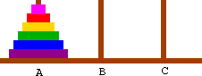

# 汉诺塔

## 问题描述



汉诺塔问题由三个杆(标为 A,B,C)和若干个大小不同的圆盘组成。

最初，所有的圆盘按大小顺序叠放在一个杆上，最小的圆盘在最上面，最大的圆盘在最下面。

目标是将所有圆盘从起始杆移动到目标杆，遵循以下规则：

1. 一次只能移动一个圆盘，每次只能移动最上面的圆盘。
2. 不能将大圆盘放在小圆盘上，任何时候，较大的圆盘不能放在较小的圆盘上。

在遵守上述规则的情况下，所有解法都需要使用辅助杆子来帮助我们移动圆盘

对于四个圆盘的汉诺塔，它的解法可能如下：


## 实验要求

judge.c按照函数功能

默认情况下从n=3到n=20调用了hanoi函数

请打开hanoi.h浏览函数功能，并在hanoi.c中完善该函数的功能

hanoi函数需要调用tower_move对汉诺塔进行操作，打开tower.h浏览该函数功能

在当前目录下运行make生成可执行文件judge

运行judge获取评测信息

可执行文件judge接受两个命令行参数

1. -d 启用debug模式，输出每次调用move时的信息
2. -n [num] 限定该次judge对n=num的塔进行

例如，你可以在成功make后，在cmd中输入：

```shell
./build/judge -d -n 3
```

## 注意事项

在本实验中你只需要修改hanoi.c下hanoi函数的主体内容

## 提示

参考[维基百科上的图解](https://upload.wikimedia.org/wikipedia/commons/2/20/Tower_of_Hanoi_recursion_SMIL.svg)

观察在n=4的情况下，问题是如何被分解的？
