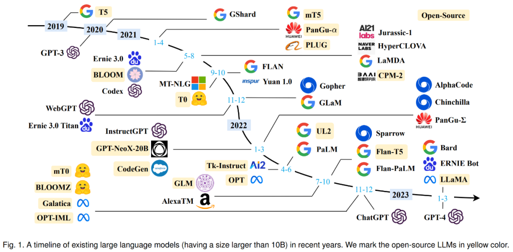

author:
  name: 讲师-晓阳
  url: https://github.com/E1PsyCongroo

departments:
  - name: "HDU-计算机科学与技术协会"
    url: https://wiki.xyxsw.site/
    img: ./static/hdu-cs-wiki.svg
+++++

# NekoBytes-TheMissing

---

## OverView

### 课程将带给你什么

- 尽可能广的介绍计算机领域
- 介绍计算机领域的核心思想：抽象
- 高效的使用基础设施（工具）
- 得到编码的锻炼（四个 Project）

--

### 你无法得到什么

- 功利的分数, etc
- 宝宝巴士一样的知识灌输
- <del>成为一名学究</del>

----

## 课程内容

> 课程还在建设中，具体内容可能会有改动
>
> 请关注[课程主页](https://wiki.xyxsw.site/2.%E7%BC%96%E7%A8%8B%E6%A8%A1%E5%9D%97/2.1%20NekoBytes-TheMissing/2.1%20NekoBytes-TheMissing)

- Unix环境(CLI的使用、POSIX)
- 什么是计算机(寄存器、内存、状态机视角)
- C 语言(基础语法、指针、动态内存管理)
- 算法导论(递归、分治、数据结构)
- 嵌入式编程(端口IO、内存IO、GPIO)
- 系统编程(进程、线程、网络通讯)
- 人工智能导论(机器学习、回归、分类)
- 编程语言导论(OOP、函数式、声明式、命令式)

++++

## 课程内容

每节课都会上传对应的讲座录屏与课程讲义

- 请你认真对待讲义附上的链接，里面的内容（除了可选）都非常适合现在的你阅读并学习（即使你需要花费大量的时间）

每节课都会有对应的课后实验

- 请认真对待课后实验，这是你获取学习反馈的重要方式
- 也是得到及时知识巩固的能力锻炼
- 每个实验预计耗时2~3h（对于有独立解决问题的同学来说）

四个课程大作业

- 你将得到具体项目的训练

----

## 独立思考

| 基本原理            | 做事方案            | 正确性风险              | 代表例子             |
| ------------------- | ------------------- | ----------------------- | -------------------- |
| <green>阐述</green> | <green>明确</green> | <green>基本正确</green> | 高中物理实验         |
| <green>阐述</green> | <green>明确</green> | <red>可能出错</red>     | 程序设计作业         |
| <green>阐述</green> | <red>需要思考</red> | <green>基本正确</green> | 数学/算法题          |
| <green>阐述</green> | <red>需要思考</red> | <red>可能出错</red>     | 练手项目             |
| <red>需要探索</red> | <red>需要思考</red> | <red>可能出错</red>     | 业界和科研的真实问题 |

学会独立思考

- 摒弃高中错误的学习姿态
- week0，其实是对你能力的一种锻炼，而“部分同学”已经开始“满头大汗”了
- [MIT对学术诚信的诠释](http://integrity.mit.edu/), 尤其是[关于写代码的学术诚信](https://integrity.mit.edu/handbook/writing-code)

--

<blue>试着去成为一个有 CS 梦想的人</blue>

----

## 学会提问

《[提问的智慧](https://github.com/ryanhanwu/How-To-Ask-Questions-The-Smart-Way/blob/master/README-zh_CN.md)》/《[别像弱智一样提问](https://github.com/tangx/Stop-Ask-Questions-The-Stupid-Ways/blob/master/README.md)》

- 提问能反映出你的学习态度: 主动尝试 vs. 被动依赖

<red>不是所有问题都值得问</red>

--

- 你以为自己热爱学习? 不, 别人只觉得你是伸手党

[都成年了，要学会提问了](https://www.bilibili.com/video/BV1om4y1H71S)

--

- <red>任何直接获得答案的做法都是在放弃训练的机会</red>

<red>你不应该剥夺自己“训练的权利”，当然也不应该让别人剥夺</red>

--

- <red>向助教提问，请遵守群内的提问模板</red>

我们是公益性质的活动，请对助教好一些 :)

躺平容易坚持难, 但如果你能坚持下来, 你就可以得到脱胎换骨的提升

---

## 如何活下来？

<red>STFW - Search The Friendly Web</red>

- 只要我用的工具是大众的, 我几乎不可能是世界上第一个遇到问题的
- 网上一定有人遇到过相同/类似问题, 我应该搜一下看看他们怎么解决

<red>RTFM - Read The Friendly Manual</red>

- 只要我用的工具是大众的, 应该有手册记录这个工具的所有细节
- 如果我想了解它的某个问题, 我应该去搜索手册的描述

<red>RTFSC - Read The Friendly Source Code</red>

- 只要我获得了项目代码, 理论上我就可以知晓它的一切行为
- 如果我想了解它具体是如何工作的, 我应该去读一下(关键)代码

++++

## 如何活下来？

<red>ATFAI - Ask The Friendly AI</red>

- “学习”从未如此高效；“因材施教” 终得以实现
- 现在真有一个像你父母一样耐心的角色
- 前提是你有能力分辨“善意的谎言”

---

## 拒绝成为“学究”

> 计算机是需要“终生学习”的领域
>
> 没有人可以完全记住所有的计算机知识
>
> 知识的学习固然重要，但解决问题的能力才是更为本质的内容

我们不希望你成为“学究”

--

“在宿舍对室友写出的`scanf("%d", a)`，指指点点”并没有多少意义

--

事实上人类并不擅长找错误

但是工具擅长：`gcc -Wall -Werror`

事实上对于找错误，人类已经不如LLM了

--

综合利用工具和AI，才是人类的强项

----

## 功利主义

“独立“完成Proj1，理论上顺手绩点5.0已经不是问题了

--

> 吾侪小人，朝不及夕，相时射利，皇恤厥德？庶几侥幸，不种而获。

<red>但我们不欢迎纯粹的功利主义</red>

--

## 协会招新

请阅读[协会介绍](https://b1n8kiruzw2.feishu.cn/docx/ZtYodltERooI6DxKEGVcHJ49ntd)

我们欢迎任何与我们理念一致的同学加入。

独立完成Proj2，这能够证明你能够进行独立的思考。

