author:
  name: 讲师-hewo
  url: https://github.com/hewo233

departments:
  - name: "NekoBytes"
    url: https://github.com/E1PsyCongroo/NekoBytes-TheMissing
    img: ./static/hdu-cs-wiki.svg
+++++

# NekoBytes-TheMissing

---

## Agenda

- **为什么学习 C 语言**
- 怎么学习 C 语言
- 用什么写 C 语言
- 数制与码制
- C 语言基础语法
- 命令行工具
- VsCode 和 vim

----

## C 语言介绍

> “C 不是一种“非常高级”的语言，也不是一种“体量大”的语言，并且不专门针对任何特定的应用领域。 但它没有限制且具有通用性，这使得它比所谓更强大的语言更方便、更有效地完成许多任务。” ——K&R

- 实现了第一个非汇编语言编写的操作系统
- 为什么要学习C？
    - 我们可以编写程序来利用计算机体系结构的底层功能
        - 内存管理！
    - 然而，这也意味着在C语言中事情更容易出错

----

## C 的优点

<table>
  <tr>
      <td>
        <ul>
          <li>贴近硬件</li>
          <li>功能强大</li>
          <li>语法简介</li>
          <li>学习轻松</li>
          <li>应用广泛</li>
          <li>关注底层</li>
          <li>以及...</li>
        </ul>
      </td>
      <td>
        

        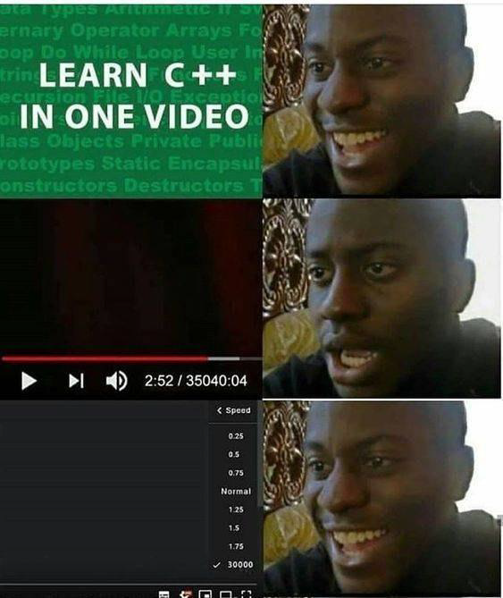
        

      </td>
  </tr>
</table>

++++

## C 的优点

- **极致的速度与节能!**

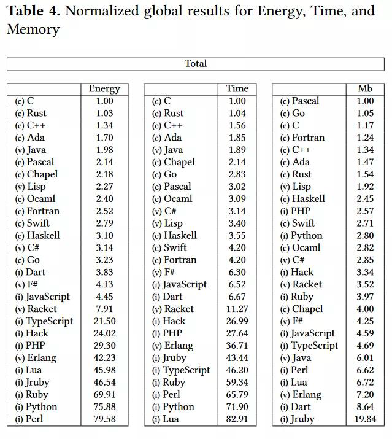

----

## Linux 系统内核

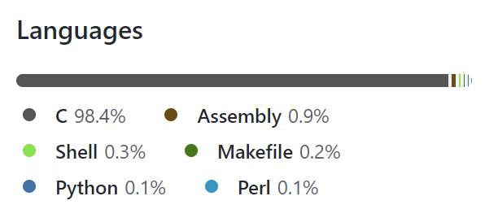

++++

## Linux 系统内核

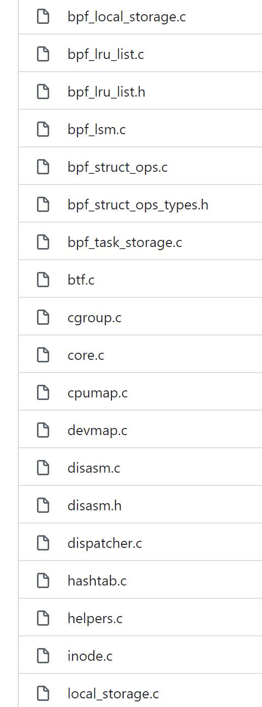
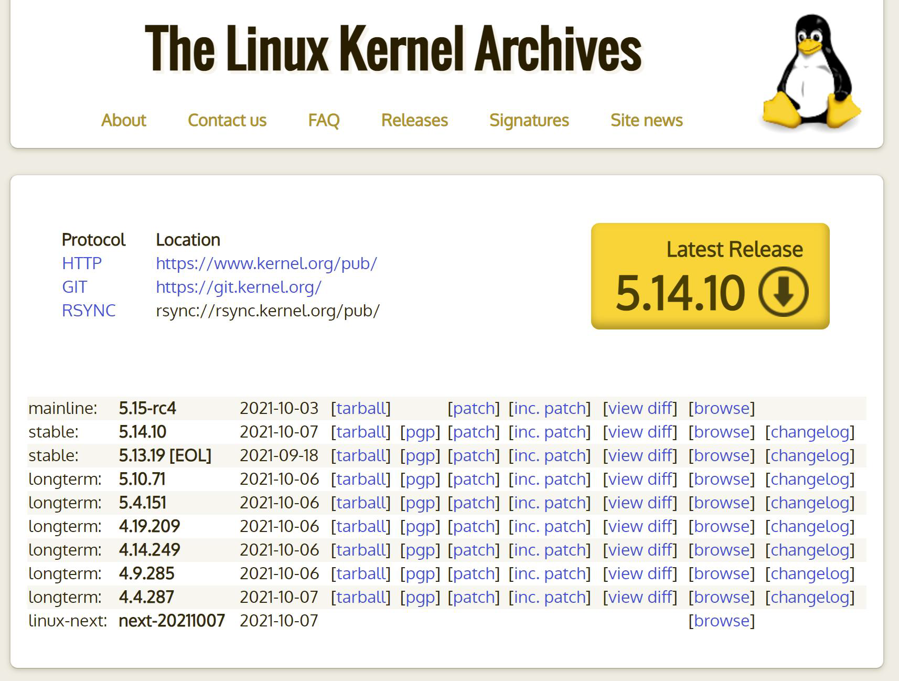

---

## Agenda

- 为什么学习C语言
- **怎么学习C语言**
- 用什么写C语言
- 数制与码制
- C语言基础语法
- 命令行工具
- VsCode和vim

----

## 学习C语言看什么书？

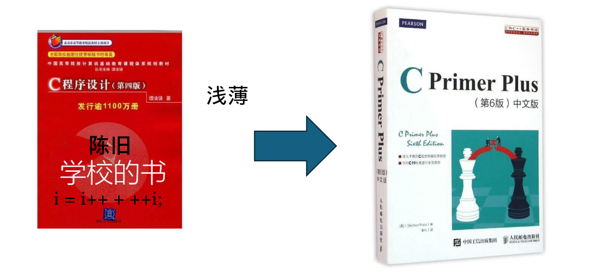

Stephen Prata. C Primer Plus.ISBN 9787115390592.

----

## C语言的推荐资源

- [杜克大学 Introductory C Programming 专项课程](https://www.coursera.org/specializations/c-programming)
- [Linux C 编程一站式学习](https://akaedu.github.io/book/)
- [The C programming language (2nd Edition)](http://cslabcms.nju.edu.cn/problem_solving/images/c/cc/The_C_Programming_Language_%282nd_Edition_Ritchie_Kernighan%29.pdf): 真正的 C 语言之父是这本书的作者 Dennis M. Ritchie, 而不是XXX
- [C Coding Standard](https://users.ece.cmu.edu/~eno/coding/CCodingStandard.html)
- [SEI CERT C Coding Standard](https://wiki.sei.cmu.edu/confluence/display/c/SEI+CERT+C+Coding+Standard)
- [Learn C the hard way 中文版](https://wizardforcel.gitbooks.io/lcthw/content/preface.html)
- **[C参考手册](https://zh.cppreference.com/w/c)**

----

## 快乐 C 之旅

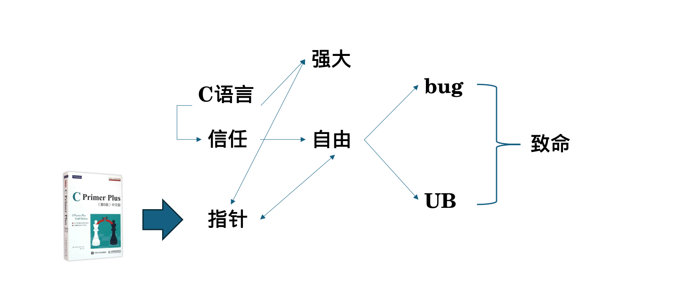

----

## 遇到问题怎么解决？

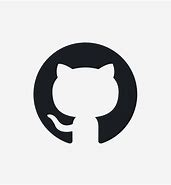

++++

## 遇到问题怎么解决？

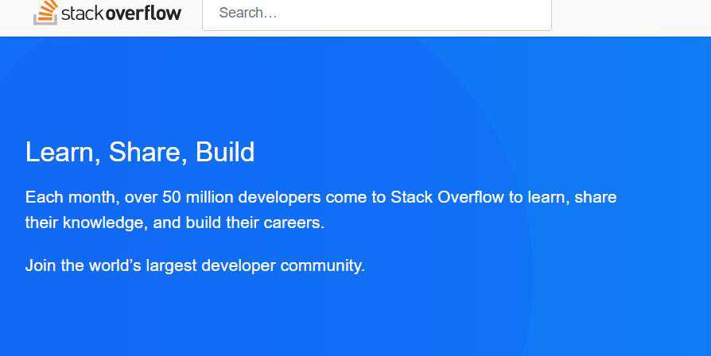

----

## RTFM: Read The Friendly Manual

为什么要阅读手册？

- 准确、迅速地给你答案

## STFW: Search The Friendly Web

RTFM 和 STFW：如何知道你已完全搞砸了

有一个古老而神圣的传统：如果你收到RTFM的回应，回答者认为你应该去读他妈的手册。当然，基本上他是对的，你应该去读一读。

RTFM 有一个年轻的亲戚。如果你收到STFW的回应，回答者认为你应该到他妈的网上搜索。那人多半也是对的，去搜索一下吧。（更温和一点的说法是 Google 是你的朋友！）

在论坛，你也可能被要求去爬爬论坛的旧文。事实上，有人甚至可能热心地为你提供以前解决此问题的讨论串。但不要依赖这种关照，提问前应该先搜索一下旧文。

++++

## RTFM: Read The Friendly Manual

为什么要阅读手册？

- 准确、迅速地给你答案

## STFW: Search The Friendly Web

通常，用这两句之一回答你的人会给你一份包含你需要内容的手册或者一个网址，而且他们打这些字的时候也正在读着。这些答复意味着回答者认为：

- 你需要的信息非常容易获得；
- 你自己去搜索这些信息比灌给你，能让你学到更多。

你不应该因此不爽；依照黑客的标准，他已经表示了对你一定程度的关注，而没有对你的要求视而不见。你应该对他祖母般的慈祥表示感谢。

---

## Agenda

- 为什么学习C语言
- 怎么学习C语言
- **用什么写C语言**
- 数制与码制
- C语言基础语法
- 命令行工具
* VsCode 和 vim

----

## IDE与编辑器

IDE（集成开发环境）和编辑器是软件开发中常用的工具。它们都用于编写、编辑和管理代码，但在功能和用途上有一些区别。

IDE是一种集成了多个工具和功能的软件，旨在提供全面的开发环境。它通常包括代码编辑器、调试器、编译器、构建工具、版本控制系统等。IDE提供了一个统一的界面，使开发人员可以在一个应用程序中完成多个开发任务。

- Visual Studio
- Clion

编辑器则更加轻量级，专注于提供代码编辑功能。它通常具有语法高亮、自动完成、代码折叠等基本功能，但不包含其他开发工具。编辑器通常更加灵活和可定制，适合开发人员根据自己的需求选择插件和扩展。

- Visual Studio Code

++++

## IDE与编辑器

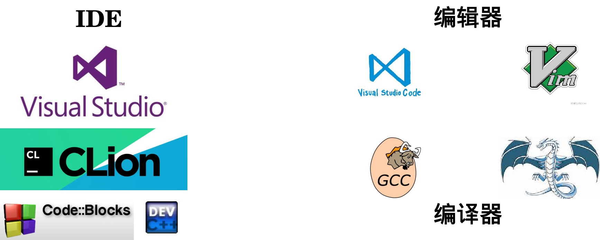

---

## Agenda

- 为什么学习C语言
- 怎么学习C语言
- 用什么写C语言
- **数制与码制**
- C语言基础语法
- 命令行工具
- VsCode和vim

----

## 二进制

使用0和1字符串表示数字的方法

为什么计算机使用二进制？

- 计算机的基本构建模块是只能表示两个值的晶体管。 我们决定将这两个值标记为 0 和 1

通过在字符串前面添加0b或添加下标2来表示

----

## 十六进制

<table>
  <tr>
      <td>
        <ul>
          <li>更易于人类阅读的二进制表示方法</li>
          <li>基数：16</li>
          <li>一位十六进制数字可以表示16个数字</li>
          <li>一位十六进制数字 = 半个字节</li>
          <li>通过前置“0x”或附加下标16来表示</li>
        </ul>
      </td>
      <td>
        

        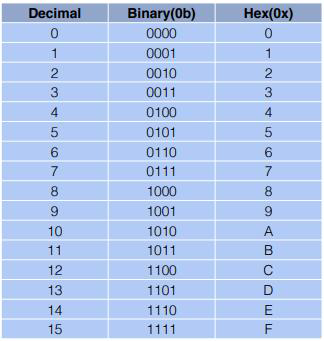
        

      </td>
  </tr>
</table>

----

## 补码（了解即可）

如何形成负数？

- 翻转位并加一

最高位代表值的符号

- 0 表示其正数
- 1 表示其负数

++++

## 补码（了解即可）

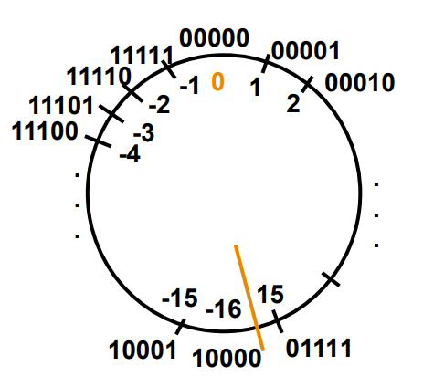

思考

- 有无符号位对表示范围的影响
- 为什么补码可以表示正负？
- 考虑忽略溢出

----

## 实数（了解即可）

定点数表示法

浮点数表示法

- IEEE 754 浮点数标准
- IEEE 754 模拟器
    - https://www.h-schmidt.net/FloatConverter/IEEE754.html

https://godbolt.org/z/Yf4Edbjee

---

## Agenda

- 如何科学的提问
- 为什么学习C语言
- 怎么学习C语言
- 用什么写C语言
- 数制与码制
- **C语言基础语法**
- 命令行工具
- VsCode和vim

----

## C 语言语法标准

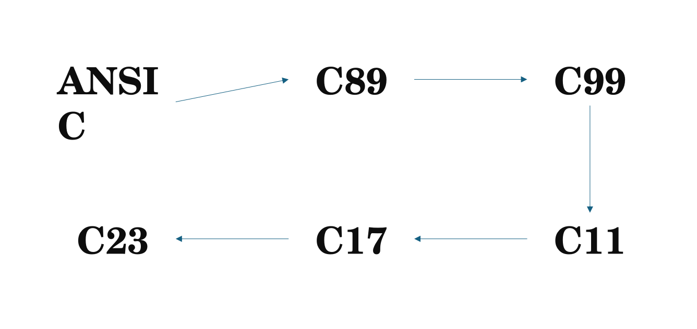

----

## 编译 vs 解释

我们在某种程度上用英语编写代码，但系统实际上只看到0和1。 我们该如何解决这个问题？

- 如果有人不懂英语，但懂法语，我们会翻译文字！
- 系统中的处理类似，但我们翻译成非人类可读的语言

翻译以两种方式进行

- 编译 （事前翻译）
- 解释 （在线翻译）
- 有些语言同时使用这两种方式！

++++

## 编译
C 编译器将 C 程序直接映射为特定于体系结构的机器代码（1 和 0 的数值串）。

- Java 转换为独立于体系结构的字节码，然后由即时 (JIT) 编译器进行编译。
- Python 在运行时而不是编译时转换为 Python 字节码。
    - 运行时编译与JIT 编译的不同之处在于程序转换为低级汇编语言并最终转换为机器代码的时间。

对于 C，处理 .c 源文件的编译通常分为 3 个部分

- .c 文件被**编译**为 .s 文件 => 由编译器编译
- .s 文件被**汇编**为 .o 文件 => 由汇编器汇编（此步骤一般是隐藏的，所以大多数时候我们直接将.c文件转换为.o文件）
- .o 文件**链接**在一起创建可执行文件 => 由链接器链接

----

## C 编译概述

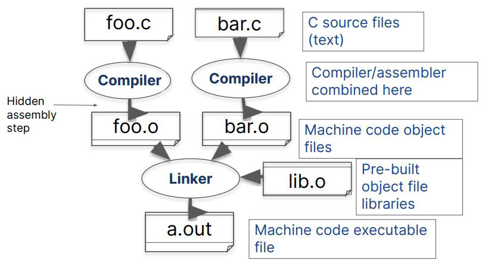

----

## 起点：Hello World
https://godbolt.org/z/4esj9rvar

程序的组成要件

- 预编译指令
- main函数
- 注释
- 限定符
- 花括号、函数体和块
- 声明
- 赋值
- 函数调用
- return语句——返回值

----

## C Pre-Processor（CPP）——C 预处理器

C 源文件在编译器看到代码之前首先经过预处理器(CPP)处理

CPP 用单个空格替换注释

CPP 命令以“#”开头

- \#include "file.h" /\* 将 file.h 插入到文件 \*/
- \#include <stdio.h> /\* 在标准位置查找文件，但没有实际区别 \*/
- \#define PI (3.14159) /\* 定义常量 \*/
- \#if/\#endif /\* 有条件地包含文本 \*/

使用 gcc 的 –save-temps 选项查看预处理结果

- 完整文档位于：http:// /gcc.gnu.org/onlinedocs/cpp/

----

## 标准库——官方DLC

标准库（Standard Library）是一组在编程语言中提供常用功能和工具的软件库。在C语言中，标准库是由C标准委员会定义的，它包含了一系列的头文件和函数，提供了许多常见的操作和功能，如输入输出、字符串处理、内存管理、数学运算等。

官方DLC

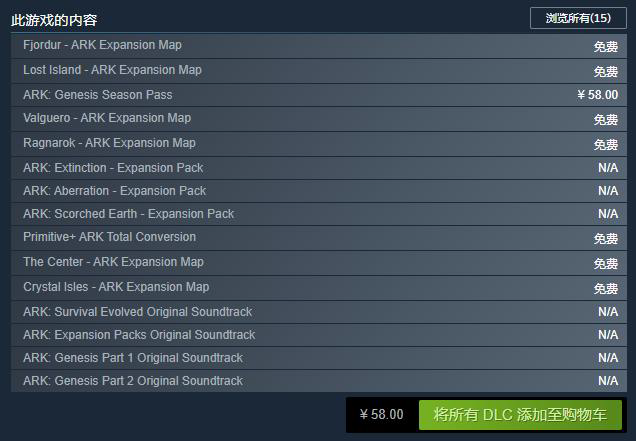

++++

## 标准库——官方DLC

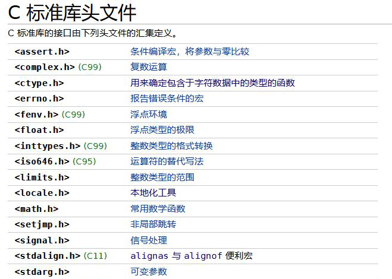
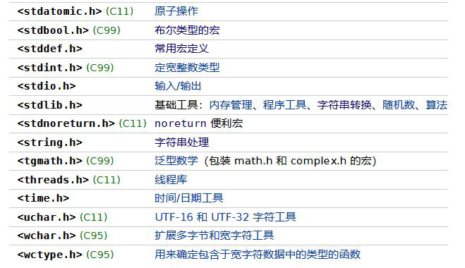

----

## 第三方库——社区模组

第三方库（Third-party library）是由独立的开发者或组织创建和维护的软件库，它们不是编程语言的标准库的一部分。第三方库通常提供了额外的功能和工具，以扩展编程语言的能力，使开发者能够更快速、更方便地开发应用程序。

社区模组

----

## 主函数：main

简单的main函数形式：

- int main(void)

要让 main 函数接受参数，请使用以下语句：

- int main (int argc, char *argv[])

这是什么意思？

- argc 将包含命令行上的字符串数量（可执行文件计为 1，每个参数加 1）。 这里 argc 是 2
    - $ touch a.txt
- argv 是一个指向数组的指针，该数组包含字符串形式的参数。

----

## C 基本变量类型

必须声明变量的类型

- 强变量类型——类型不能更改。 例如. int var = 2;

| 类型         | 描述                                      | 例子                      |
| ------------ | ----------------------------------------- | ------------------------- |
| char         | 8位，ASCII                                | ‘a’, ‘A’, ‘\n’, 12        |
| int          | 整数值（正、负、0），>= 16 位，一般为32位 | 0, 78, -217, 0x2E         |
| unsigned int | 整数值（正、0）                           | 0, 6, 35102               |
| short        | 整数值（正、负、0），>= 16 位，一般为16位 | 0, -8, 32767              |
| long         | 整数值（正、负、0），>= 32 位，一般为32位 | 0, 78, -217, 301713123194 |

++++

## C 基本变量类型

| 类型      | 描述                                      | 例子              |
| --------- | ----------------------------------------- | ----------------- |
| long long | 整数值（正、负、0），>= 32 位，一般为64位 | 31705192721092512 |
| float     | 单精度浮点数，32位，IEEE 754              | 0.0, 3.14, 6.02e3 |
| double    | 双精度浮点数，64位，IEEE 754              | ^                 |
| etc.      |                                           |                   |

## 类型的本质

类型的本质是对二进制串的不同理解方式

- 计算机中本只有0和1，理解的方式多了，便成了数据类型

https://godbolt.org/z/bP1rbWTae

---

## Agenda

- 为什么学习C语言
- 怎么学习C语言
- 用什么写C语言
- 数制与码制
- C语言基础语法
- **命令行工具**
- VsCode 和 Vim

----

## 为什么要用命令行

作为计算机的直接操控者，CLI 会给你提供更加直接的操作

想想修改系统某处的时候，你是会选择手忙脚乱的翻 GUI,还是几行命令解决？

更何况，CLI 其实更加方便。当你熟练使用，并且配置舒服后，你会喜欢上 CLI 的。

----

## Git

Git是**分布式版本控制系统**的一大代表

本地版本控制系统

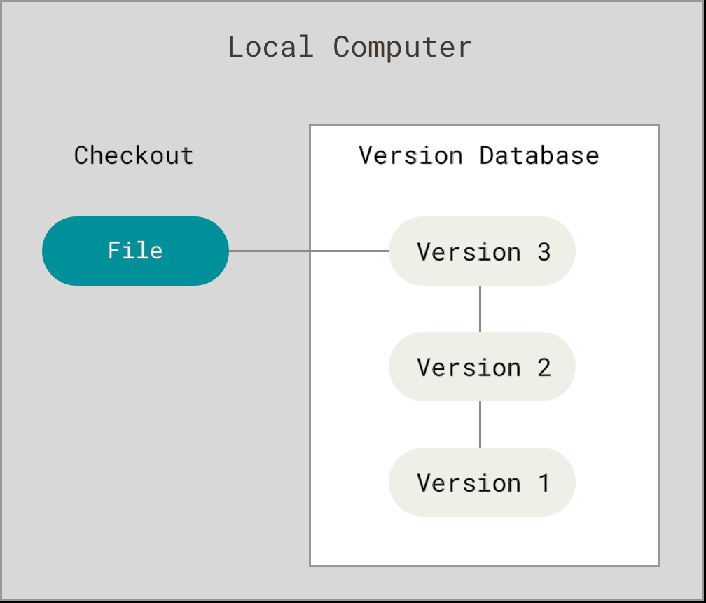

++++

## Git

集中化的版本控制系统

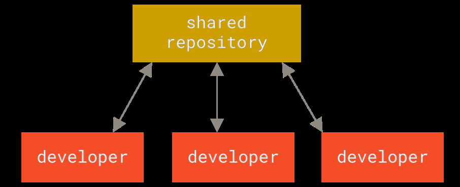

++++

## Git

**分布式版本控制系统**

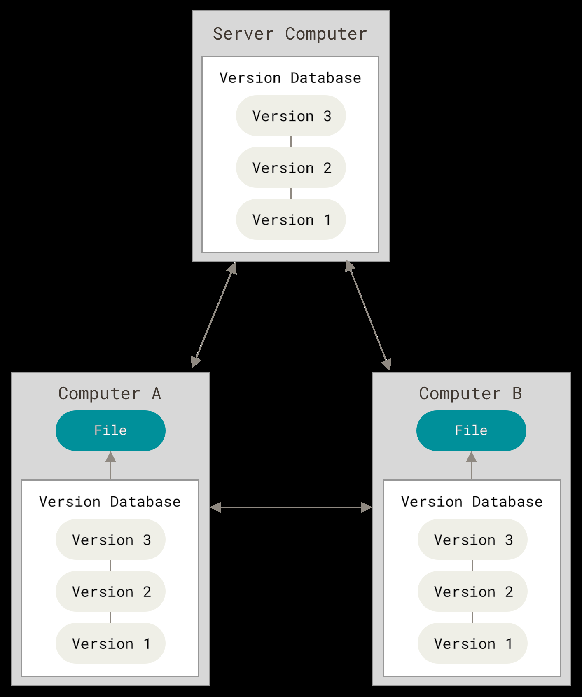

----

## Git的命令行接口

- sudo apt install git
- git help <command\>
- git init
- git status
- git add <filename\>
- git commit
- git log
- git log --all --graph --decorate: 可视化历史记录（有向无环图）

++++

## Git的命令行接口

- ### git clone <url\>

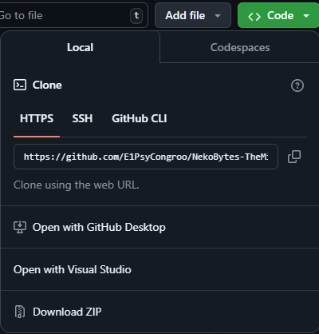

----

## 怎么学git

自己动手实操

- [Learn Git Branching](https://learngitbranching.js.org/)（没有项目也能实操）

推荐书籍：

- [Pro Git](https://git-scm.com/book/en/v2)

----

## tar

| 文件后缀 | 解压命令              |
| -------- | --------------------- |
| .tar     | tar -xvf <filename\>  |
| .tar.gz  | tar –xzvf <filename\> |
| .tar.bz2 | tar –xjvf <filename\> |
| .tar.xz  | tar –xJvf <filename\> |

怎么来的？ RTFM！

----

## GCC

gcc 全称GNU project C and C++ compiler

gcc是C语言的一种编译器

易混淆的三样东西

- Visual Studio——IDE
- Visual Studio Code——文本编辑器
- GCC——编译器

----

## GCC的命令行接口

功能参数

- -o 指定输出文件名
- -Wall 开启警告
- -O(2/3, ...) 优化

完整命令

- gcc –o xxx xxx.c

运行

- ./xxx

项目构建

- Make 与 Makefile

---

## Agenda

- 如何科学地提问
- 为什么学习C语言
- 怎么学习C语言
- 用什么写C语言
- 数制与码制
- C语言基础语法
- 命令行工具
- **VsCode和vim**

----

## VSCode环境配置

检查你的 week0

适合自己的才是最好的

----

## Vim的哲学

在编程的时候，你会把大量时间花在阅读/编辑而不是在写代码上。所以，Vim 是一个*多模态*编辑器：它对于插入文字和操纵文字有不同的模式。Vim 是可编程的（可以使用 Vimscript 或者像 Python 一样的其他程序语言），Vim 的接口本身也是一个程序语言：键入操作（以及其助记名） 是命令，这些命令也是可组合的。Vim 避免了使用鼠标，因为那样太慢了；Vim 甚至避免用 上下左右键因为那样需要太多的手指移动。

这样的设计哲学使得 Vim 成为了一个能跟上你思维速度的编辑器。

