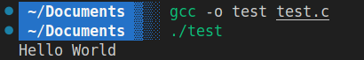
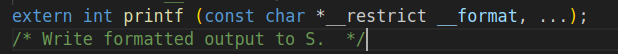
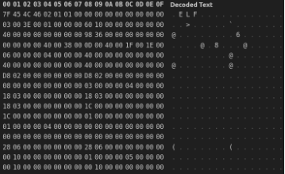
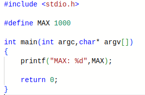
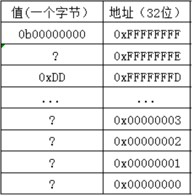

author:
  name: M4yGem1ni
  url: https://github.com/M4yGem1ni

departments:
  - name: "NekoBytes"
    url: https://github.com/E1PsyCongroo/NekoBytes-TheMissing
    img: ./static/hdu-cs-wiki.svg
+++++

# C 语言基础语法

---

## Agenda Part 1


- 计算机科学抽象思维
- C语言常量
- C中的控制流
- 函数
- 数组
- 字符串
- 宏定义与预处理

----

## 抽象是什么？能吃吗

- 抽象好比是一个黑箱，我们不需要知道中间发生的过程，只需要知道我输入了什么，我能输出什么，最简单的例子就是 `printf`。






----

## 编程本身就是一种抽象

- 我们使用的编程语言，比如C语言和Python，都是抽象，因为计算机只懂二进制。


<center>


</center>
----

## 抽象的力量
[https://www.2048.org](https://www.2048.org)
这是一个2048
我们可以将其分解为以下几个模块

- 游戏板: board[BOARD_SIZE][BOARD_SZIE]
- 初始化: initialize_board
- 随机生成: generator_number
- 打印显示: print_board
- 读取移动指令: choose_direction
- 合并并移动: move_and_merge
- 判断游戏终止: is_finished

----

## 抽象的力量

```c
run_game() {
    initialize_board();
    generator_number(); generator_number();
    while (true) {
    switch (choose_direction) {
        case UP: move_and_merge_up();break;
        case DOWN: move_and_merge_down();break;
        case LEFT: move_and_merge_left();break;
        case RIGHT:move_and_merge_right();break;
    }
    is_finished() ? break:;
    generator_number();
    print_board();
    }
}
```

----

## 变量

```c
typedef unsigned char uint8_t;
```

| 类型         | 描述                                      | 例子                      |
| ------------ | ----------------------------------------- | ------------------------- |
| char         | 8位，ASCII                                | ‘a’, ‘A’, ‘\n’, 12        |
| int          | 整数值（正、负、0），>= 16 位，一般为32位 | 0, 78, -217, 0x2E         |
| unsigned int | 整数值（正、0）                           | 0, 6, 35102               |
| short        | 整数值（正、负、0），>= 16 位，一般为16位 | 0, -8, 32767              |
| long         | 整数值（正、负、0），>= 32 位，一般为32位 | 0, 78, -217, 301713123194 |

----

## Const 常量

```c
const int integer = 100;
const double dob = 1.20;
const char MyChar = 'c';
```

- 常量一经分配，无法更改。可以[尝试](https://godbolt.org/z/eMWfK6Edq)添加`integer = 120;`看看会发生什么。

```C
#include <stdio.h>
int main(int argc,char* argv[]) {
  const int intager   = 100;
  const double dob    = 1.20;
  const char MyChar   = 'c';
  // 你可以在此处添加代码
  printf("intager:%d\ndob:%lf\nMyChar:%c\n",
         intager,dob,MyChar);
  return 0;
}
```

----

## C中的控制流

- 语句(statement)可以是代码块 {} 或只是一个独立的语句
    - if-else

    `if (expr) statement`

    `if (x == 0) y++;`

    `if (x == 0) {y++;}`

    `if (x == 0) {y++; j = j + y;}`

    `if (expr) statement1 else statement2`

    - switch case
    - while: `while (expr) statement`
    - for: `for (initialize; check; update) statement`

[https://godbolt.org/z/j8s5TEb7a](https://godbolt.org/z/j8s5TEb7a)

----

## 函数

- 在编程中，函数是一段可重复使用的代码块，用于执行特定的任务或完成特定的操作。函数可以接受输入参数，并且可以返回一个值或执行一些操作
- 代码重用
- 提高代码可读性
- 提高代码可测试性（单元测试）
- 抽象

[https://godbolt.org/z/11bxvT8Ga](https://godbolt.org/z/11bxvT8Ga)

----

## 数组

- 数组就是一整块变量的集合，数组名是数组存放的地址，使用索引确定每个元素的位置
- 定义：unsigned char temp[10] = {0x11,0x12,0x13};
- 使用：printf(“%02x ”,temp[0]);

[https://godbolt.org/z/rzo6o1bsE](https://godbolt.org/z/rzo6o1bsE)

```C
#include <stdio.h>
int main(){
  unsigned char temp[10] = {0x11,0x15,0x22};
  printf("temp address: %p\n",temp);
  temp[3] = 0xa8;
  for (size_t i=0;i<10;i++) printf("%02x ",temp[i]);
  printf("\n");
  return 0;
}
```

----

## 字符串

- 字符串是一种特殊的数组，以`'\0'`结束。
- 使用 `<string.h>` 标准库进行更多操作。

[https://godbolt.org/z/3jrrvchE1](https://godbolt.org/z/3jrrvchE1)
```c
#include <stdio.h>
#include <string.h>

//  字符串以\0结尾

int main(){
    char str1[] = "I Can Eat Glass";
    char str2[20] = "I Can Eat Glass";

    printf("str1:%s\nsize:%lu\nstr2:%s\nsize:%lu\n",\
    str1,strlen(str1),str2,strlen(str2));
}
```
使用`sizeof`和`strlen`都能获取字符串长度,它们有什么区别呢?

----

## 字符串

- 使用 `<string.h>` 标准库进行更多操作。

[https://godbolt.org/z/sz8Ms1nTj](https://godbolt.org/z/sz8Ms1nTj)


----

## 宏定义

- `#define` 是文本替换，比如 `#define MAX 1000`
- C预处理器先处理源文件，替换宏并包含文件。



[https://godbolt.org/z/aMPxbrMbs](https://godbolt.org/z/aMPxbrMbs)

gcc -o test test.c -save-temps

关于这块，比较好玩的就是微软早期路径长度在编写时使用了宏定义
`#define MAX_PATH 260`
导致最长路径除了”C:\\”之外，只能有255个字符来指代路径了，虽然现在支持在注册表里面进行更改，不过会引发一些神奇的小bug，这个就留给大家进行探索了

----

## 预处理
C 源文件在编译器看到代码之前首先经过预处理器 CPP
CPP 用单个空格替换注释
CPP 命令以“#”开头
- #include "file.h" /* 将 file.h 插入到文件 */
- #include <stdio.h> /* 在标准位置查找文件，但没有实际区别 */
- #define PI (3.14159) /* 定义常量 */
- #if/#endif /* 有条件地包含文本 */

使用 gcc 的 –save-temps 选项查看预处理结果
完整文档位于：http:// /gcc.gnu.org/onlinedocs/cpp/

----

## Cat Break!


---

## Agenda Part 2


- 内存与变量
- 多维数组
- 指针的初步介绍
- 指针的进一步理解
- 指针与数组
- 指针与const
- void指针
- 警惕UB

----

## 内存



----

## 变量与垃圾值
```c
unsigned int a = 1;
int b = -1;
float c = 1.5f;
```

变量可以被分为四个部分：
int ：类型
b   ：标识
-1  ：值
&b  ：地址

[https://godbolt.org/z/ocbrj7s85](https://godbolt.org/z/ocbrj7s85)


----

## 数组的越界行为
```c
int array[5] = { 1, 2, 3, 4, 5 };
```
array 这个标识符是什么呢？


问：能不能访问array[5]呢？

----

## 多维数组(目前了解即可)
```c
int array[2][2] = {{1,2},{3,4}};
```

matrix的类型: int[2][2]
sizeof matrix = sizeof(int) * 2 * 2

[https://godbolt.org/z/Mbq513KnG](https://godbolt.org/z/Mbq513KnG)


(问：下面哪种写法是正确的?)
```c
int matrix[][2] = {1,2,3,4};
int matrix[2][] = {1,2,3,4};
```
----
## 指针
指针也可以看作一个变量，我们对其的定义是这样的
```c
int a = 1;
int* p = &a;
```
int* : int表示指针指向的元素类型 *代表的是我要定义一个指针
p    : 标识符
&a   : 指针的值（指针指向的地址）
&p   : 存放指针的地址


----

## 指针初始化与使用

```c
int* p;
*p = 1; //  危险，p是野指针
```
应该这么做
```c
int* p = NULL;
```
当要使用指针指向的值的时候，可以对指针进行解引用
```c
int a = 1;
int* p = &a;
*p = 2;
printf("%d",*p);
```

----

## 指针的作用
指针是C语言的精髓，广泛运用于传参等方面

[https://godbolt.org/z/8MeTzaGjo](https://godbolt.org/z/8MeTzaGjo)

看完这个例子后，想一想scanf("%d",&a);为什么需要取a的地址？

----

## 数组和指针的关系
```c
// p1的类型是int* , array的类型是int[10]
int array[10];
int *p1 = array;

// p2的类型是int*[2] , matrix的类型是int[][]
int matrix[2][2];
int (*p2)[2] = matrix;
```
数组与其元素类型的指针存在隐式转换，指向数组首元素的指针可通过数组类型表达式初始化。

问：二维数组可以和二维指针相互转化吗
```c
int array[2][2];
int** ptr = array;
//可以这么做吗
```

----

## const与指针的关系
前文提到const就像一把锁，被它锁到的事物不能被更改

```c
int a;

// 锁住指针p指向的int类型变量
const int *p = &a;
// 锁住指针本身，但指针指向的元素可以修改
int const *p = &a;
// 一起锁
const int const *p = &a;
```
假设你有一段音频文件，你想要进行播放，那你绝对不想播放器修改你的音频，那你可以使用const来设计函数，这样就绝对无法更改了
```c
void wav_player(const int *ptr);
```

----

## 指针的加减法

加、减
加、减整数n -> 指向后/前第n个元素

指针相减
表示指针之间的偏移量

仅当原指针和结果指针都指向同一数组中的元素，或该数组的尾后一位置，行为才有定义。

[https://godbolt.org/z/q9M6W81x3](https://godbolt.org/z/q9M6W81x3)

----

## 警惕UB(未定义行为)

我们很多时候需要警惕未定义行为，就比如说
```c
a[i] = ++i +1;
```
i在这里多次使用且数值发生了改变，没人知道a[i]先执行还是++i先执行
```c
// i=0
int a = f(i++)+f(i++)-f(i++);
```
虽然在最后的结果上编译器会将其翻译为int a = (f(i++)+f(i++))-f(i++);
但没人知道哪个f(i++)最先执行，可能是第一个，也可能是第三个

> 详情请参考
> https://zh.cppreference.com/w/c/language/behavior
> https://zh.cppreference.com/w/c/language/eval_order


----

## Ask Time

