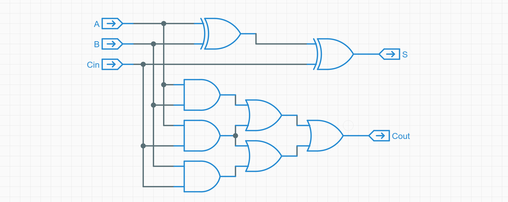
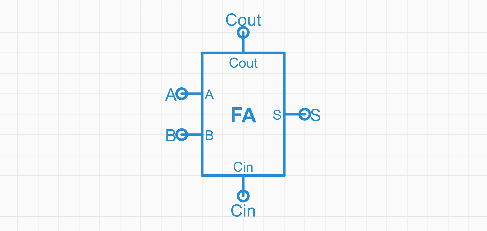
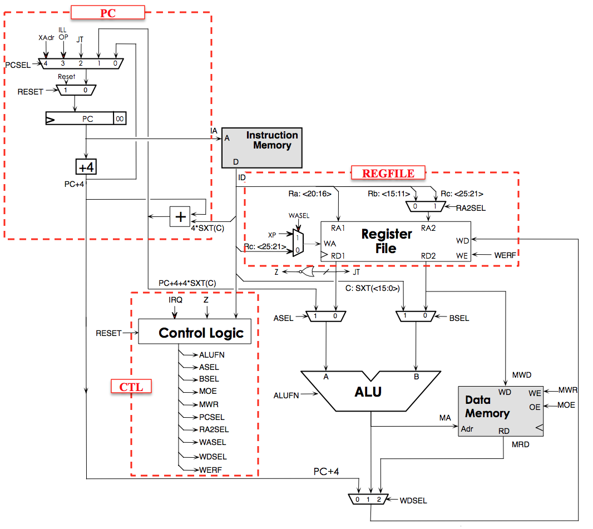

{
    "author": {
        "name": "自由，M4yGem1ni",
    },
    "departments": [
        {
            "name": "NekoBytes",
            "url": "https://github.com/E1PsyCongroo/NekoBytes-TheMissing",
            "img": "./static/hdu-cs-wiki.svg"
        }
    ]
}
+++++

# 从软件到硬件

---

## 计算机的数学视角

> 计算机系统是严格的数学对象：没有魔法；计算机系统的一切行为都是可观测、可理解的。

+ 状态机模型
+ 计算机的状态机视角
+ 指令集
+ 汇编语言和机器语言
+ 冯·诺伊曼体系结构

----

## [状态机模型](https://zh.wikipedia.org/wiki/%E6%9C%89%E9%99%90%E7%8A%B6%E6%80%81%E6%9C%BA)
状态机: 表示有限个状态以及在这些状态之间的转移和动作等行为的**数学计算模型**

+ 状态
+ 会根据输入（激励）改变自身的状态
+ 简单的状态机
    + **安静状态** → *看到人* → **吠叫状态**
    + **吠叫状态** → *人给香肠* → **进食状态**
    + **进食状态** → *吃完香肠* → **安静状态**

----

## 计算机是个状态机

+ 状态：各个**设备**的电路状态
+ 激励：外部的输入（鼠标、键盘）

## 程序是个状态机

+ 状态：**寄存器**、**内存**
+ 激励：执行新的**指令**

----

## 指令集

+ 输入的指令 -> 要做什么操作
+ 程序员和CPU的一种约定
+ 常见的指令集:
    + x86_64(amd64)
    + ARM
    + RISC-V
    + MISP
    + LoongArch

----

## 汇编语言和机器语言

+ 机器语言

```txt
00000040: 4111 06e4 22e0 0008 1705 0000 1305 0500
00000050: 9700 0000 e780 0000 8147 3e85 a260 0264
00000060: 4101 8280
```

+ 汇编语言

```asm
main:
        addi    sp,sp,-16
        sd      ra,8(sp)
        sd      s0,0(sp)
        addi    s0,sp,16
```

几乎是简单的替换

++++

## 汇编语言和机器语言

几乎是简单的替换

```shell
0000000000000000 <main>:
   0: 1141        addi sp,sp,-16
   2: e406        sd     ra,8(sp)
   4: e022        sd     s0,0(sp)
   6: 0800        addi s0,sp,16
   8: 00000517    auipc a0,0x0
   c: 00050513    mv a0,a0
  10: 00000097    auipc ra,0x0
  14: 000080e7    jalr ra #10 <main+0x10>
  18: 4781        li a5,0
  1a: 853e        mv a0,a5
  1c: 60a2        ld ra,8(sp)
  1e: 6402        ld s0,0(sp)
  20: 0141        addi sp,sp,16
  22: 8082        ret
```

----

## 体会高级语言到机器语言

+ C语言`main.c` -> 汇编语言`main.S`

```shell
gcc ./main.c -S ./main.S
```

+ 汇编语言`main.S` -> 可执行文件`main`

```shell
gcc ./main.S -o ./main
```

> `main`并不只包含了机器语言，还包含了指示系统如何运行这个文件的信息。

----

## [图灵机](https://zh.wikipedia.org/wiki/%E5%9B%BE%E7%81%B5%E6%9C%BA)

+ CPU如何自动计算？
+ 下一条指令在哪里？ —— 程序计数器PC

```c
while (1) {
  从PC指示的存储器位置取出指令;
  执行指令;
  更新PC;
}
```

+ 图灵机
    + 存储器、PC、加法器
    + 从PC指示的存储器位置取指 -> 执行 -> 更新PC

---

## 计算机的硬件视角

+ 冯·诺伊曼体系结构
+ 逻辑门电路
+ 运算器
+ 处理器

----

## [冯·诺伊曼体系结构](https://zh.wikipedia.org/wiki/%E5%86%AF%E8%AF%BA%E4%BC%8A%E6%9B%BC%E7%BB%93%E6%9E%84)

+ 运算器：ALU

+ 控制器：逻辑电路控制器

+ 存储器：内存、寄存器

+ 总线：
    + 输入设备：键盘、鼠标
    + 输出设备：显示器

> 冯·诺伊曼体系结构的核心思想
>
> + 使用二进制表示数据
> + 程序指令和数据并存
> + 计算机的五个基本组成部分

----

## CPU的执行过程

```asm
addi x1, x0, 0xf 0x00f00093
```


----

## 逻辑电路

<hr>
定义如下规则：
<hr>
+ 非门：一个输入，一个输出，输入输出相反。
+ 与门：两个输入，一个输出。两边全是1，则输出为1，否则为0
+ 或门：两个输入，一个输出。两边有一个是1，则输出为1，否则为0
+ 异或门：两个输入，一个输出。两边不同，则输出为1，否则为0

[Computation Structure](https://computationstructures.org/exercises/ALU/lab.html)
----

## 加法

使用两个异或门和两个与门和一个或门，实现了一个加法器

<hr>

+ A,B：对应的两个加数
+ Cin：前一项的进位
+ S：计算结果（A,B,Cin有奇数个1则输出1）
+ Cout：进位(A,B,Cin有两个为1则输出1)

<hr>



----

## 抽象

将之前的电路抽象成一个icon
这样便无需在意里面的具体细节
<hr>



----

## 加法器组合

<hr>

逐个拼接就能实现32位，乃至64位的加法

<hr>
+ AFN为1代表是减法
+ 减法是以加法为基础来进行计算的

<hr>


----

## 再次抽象

<hr>

将这个电路模型抽象为一个icon

<hr>


----

## 按照这个思路构建ALUMNI

<hr>

+ SHIFT：实现数据的移位
+ BOOL：进行布尔运算
+ AIRTH：进行加法减法运算
+ CMP：与AIRTH紧密结合，根据其输出判断A,B大小关系

<hr>


----

## 构建CPU

按照这个思路继续抽象，便能得到一个CPU的模型
<hr>



---

## 操作系统

> 可执行文件并不只包含了该程序的机器语言，还包含了指示系统如何运行这个文件的信息。

+ 什么是操作系统？
+ 硬件视角的操作系统
+ Three Easy Pieces

----

## 实验 - 验证可执行文件

> 获取代码: https://e1psycongroo.github.io/NekoBytes-TheMissing/_site/resources/Lecture3/Codes/os-exec

```c
#include <sys/syscall.h>
#include <unistd.h>
const char str[] = "\033[01;31mHello, OS World\033[0m\n";
const int str_size = sizeof str - 1;
int main(void) {
  asm volatile("movl %0, %%eax\n\t" // 系统调用号：SYS_write
               "movl $1, %%edi\n\t" // 文件描述符：STDOUT_FILENO (标准输出)
               "movq %2, %%rsi\n\t" // 字符串地址
               "movl %3, %%edx\n\t" // 字符串长度
               "syscall"            // 调用系统调用
               :
               : "r"(SYS_write), "r"(STDOUT_FILENO), "r"(str), "r"(str_size)
               : "eax", "edi", "rsi", "edx");
  return 0;
}

```

----

## 什么是操作系统？


<div class="center">管理进程、服务进程、管理硬件</div>

----

## 内存模型与规范

+ 指令集、编译器、操作系统遵循同一规范
  + System V ABI


----

## 实验 - 栈和堆的地址

> 获取代码: https://e1psycongroo.github.io/NekoBytes-TheMissing/_site/resources/Lecture3/Codes/stack.c

```c
#include <stdio.h>
#include <stdlib.h>
int main(void) {
    int x = 1;
    void *y = malloc(sizeof(int));
    printf("stack: %p\n", (void *)&x);
    printf("heap : %p\n", y);
    free(y);
    return 0;
}
```

可能的输出：

```txt
stack: 0x7ffd27bb38dc
heap : 0x59e598fe42a0
```

----

## 硬件视角的操作系统

+ 只是一个简单的程序（裸机程序）
+ 但是直接操作硬件
  + 直接发送指令给磁盘
  + 直接接受键盘的原始输入
  + 直接……
+ 以特殊的方式启动其它程序，就像调用一个函数一样
  + 将程序加载到内存中，并跳转到程序的入口处。

----

## Three Easy Pieces

+ 虚拟化
    + 所有进程都以为自己有一整个苹果吃
    + 以为自己独占CPU、内存……
+ 并行
    + 浏览器、VSCode等程序一起运行，同时？
    + 在CPU上不断切换正在运行的程序
+ 持久化
    + 我的2048Game出现了16384！但是这游戏不能存档😭😭😭
    + 组织文件系统

----

## 拓展 - 操作系统仿真

> 获取代码： https://e1psycongroo.github.io/NekoBytes-TheMissing/_site/resources/Lecture3/Codes/os-model

```c
enum {
    SYS_EXIT,  // Process exits
    SYS_WRITE, // Write to console with a character
};

typedef struct {
    unsigned int syscall;
    char arg;
} Syscall;
```

```c
typedef struct {
    int  remainingStep; // A process will run remainingStep steps
    char charToOutput;  // A process will write this character
                        // to console by doing a syscall
} Process; // Process's Context
```

++++

## 拓展 - 操作系统仿真

```c
void run() {
    Process *current;
    while (process_count()) {
        // The Operating System will randomly
        // choose a process to run
        current = process_schedule();
        // Switch process context and run it until a syscall
        Syscall call = process_step(current);
        if (call.syscall == SYS_EXIT) {
            // Process exits
            process_exit(current);
        } else if (call.syscall == SYS_WRITE) {
            // Write the character from syscall arg to the console
            putchar(call.arg);
        }
    }
    putchar('\n');
}
```

++++

## 拓展 - 操作系统仿真

```c
int main() {
    // Initialize the Operating System
    init();
    // spawn processes
    spawn_process(5, 'A');
    spawn_process(5, 'B');
    spawn_process(5, 'C');
    // start running
    run();
    return 0;
}
```

可能的输出：

```text
AABCCCBBBCBCAAA
BBAACCCABBACCAB
CAAACBCCBBAACBB
```
