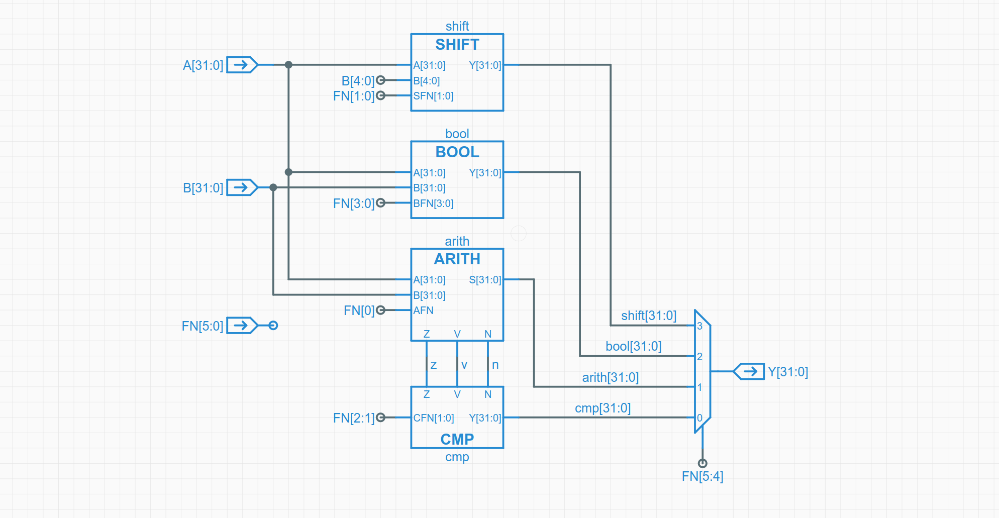

{
    "author": {
        "name": "自由，M4yGem1ni",
    },
    "departments": [
        {
            "name": "NekoBytes",
            "url": "https://github.com/E1PsyCongroo/NekoBytes-TheMissing",
            "img": "./static/hdu-cs-wiki.svg"
        }
    ]
}
+++++

# 从软件到硬件

---

## CPU
<hr>
<hr>
+ 指令集
+ 汇编语言和机器语言
+ 图灵机
+ CPU的组成

----

## 指令集
<hr>
<hr>
+ 输入的指令 -> 要做什么操作
+ 程序员和CPU的一种约定
<hr>
+ 常见的指令集： 
    - x86_64(amd64)
    - ARM
    - RISC-V
    - LoongArch

----
## 汇编语言和机器语言
+ 机器语言
```text
00000040: 4111 06e4 22e0 0008 1705 0000 1305 0500
00000050: 9700 0000 e780 0000 8147 3e85 a260 0264
00000060: 4101 8280
```
+ 汇编语言
```asm
main:
        addi    sp,sp,-16
        sd      ra,8(sp)
        sd      s0,0(sp)
        addi    s0,sp,16
```

<hr>

几乎是简单的替换

----

## 汇编语言和机器语言
几乎是简单的替换
```text
0000000000000000 <main>:
   0:	1141        addi	sp,sp,-16
   2:	e406        sd	    ra,8(sp)
   4:	e022        sd	    s0,0(sp)
   6:	0800        addi	s0,sp,16
   8:	00000517    auipc	a0,0x0
   c:	00050513    mv	a0,a0
  10:	00000097    auipc	ra,0x0
  14:	000080e7    jalr	ra #10 <main+0x10>
  18:	4781        li	a5,0
  1a:	853e        mv	a0,a5
  1c:	60a2        ld	ra,8(sp)
  1e:	6402        ld	s0,0(sp)
  20:	0141        addi	sp,sp,16
  22:	8082        ret
```

----

## 体会高级语言到机器语言
<hr>
+ C语言`main.c` -> 汇编语言`main.S`
```shell
gcc ./main.c -S ./main.S
```
+ 汇编语言`main.S` -> 可执行文件`main.out`
```shell
gcc ./main.S -o ./main.out
```
<hr>
<hr>
> `main.out`并不只包含了机器语言，还包含了指示系统如何运行这个文件的信息。

----
## 图灵机
+ CPU如何自动计算？
+ 下一条指令在哪里？ —— 程序计数器PC
<hr>
```c
while (1) {
  从PC指示的存储器位置取出指令;
  执行指令;
  更新PC;
}
```

+ 图灵机
    - 存储器、PC、加法器
    - 从PC指示的存储器位置取指 -> 执行 -> 更新PC

----

## CPU的组成

### 寄存器 Register
+ CPU的内部存储器
+ 快速存储和访问

### 算数逻辑单元 ALU
+ 执行各种逻辑运算
+ 根据信号选择输出

### 总线
+ CPU与外部设备交互、各种协议

### 缓存
+ 外设速度和CPU速度差异
+ 快速访问

----

## CPU的执行过程
> `addi x1, x0, 0xf` (`0x00f00093`)


---

## 冯诺依曼计算机系统

+ 运算器：ALU
  
+ 控制器：译码单元

+ 存储器：内存、寄存器
  
+ 输入设备：键盘、鼠标
  
+ 输出设备：显示器

> 冯诺依曼计算机系统的存储器和运算器是分离的。


---

## 状态机

+ 有状态
+ 会根据输入改变自身的状态（激励）
+ 简单的状态机
    - **安静状态** → *看到人* → **吠叫状态**
    - **吠叫状态** → *人给香肠* → **进食状态**
    - **进食状态** → *吃完香肠* → **安静状态**

----

## 计算机是个状态机

+ 状态：寄存器、内存的值
+ 激励：外部的输入、指令的变更

<hr>
<hr>

## 程序是个状态机
+ 状态？
+ 激励：执行新的指令

---

## 硬件形式上的计算机

<hr>
定义如下规则：
<hr>
+ 非门：一个输入，一个输出，输入输出相反。
+ 与门：两个输入，一个输出。两边全是1，则输出为1，否则为0
+ 或门：两个输入，一个输出。两边有一个是1，则输出为1，否则为0
+ 异或门：两个输入，一个输出。两边不同，则输出为1，否则为0

[ComputationStructure](https://computationstructures.org/exercises/alu/lab.html)
----

## 加法

使用两个异或门和两个与门和一个或门，实现了一个加法器

<hr>

+ A,B：对应的两个加数
+ Cin：前一项的进位
+ S：计算结果（A,B,Cin有奇数个1则输出1）
+ Cout：进位(A,B,Cin有两个为1则输出1)

<hr>


----

## 抽象

将之前的电路抽象成一个icon
这样便无需在意里面的具体细节
<hr>


----
## 加法器组合

<hr>

逐个拼接就能实现32位，乃至64位的加法

<hr>
+ AFN为1代表是减法
+ 减法是以加法为基础来进行计算的

<hr>


----
## 再次抽象
<hr>

将这个电路模型抽象为一个icon

<hr>


----
## 按照这个思路构建alu

<hr>

+ SHIFT：实现数据的移位
+ BOOL：进行布尔运算
+ AIRTH：进行加法减法运算
+ CMP：与AIRTH紧密结合，根据其输出判断A,B大小关系

<hr>



----
## 构建CPU
按照这个思路继续抽象，便能得到一个cpu的模型
<hr>


---

## 操作系统
+ 什么是操作系统？
+ 硬件视角的操作系统
+ Three Easy Pieces

----

## 什么是操作系统？


<div class="center">管理进程、服务进程、管理硬件</div>

----

## 内存模型与规范

+ 指令集、编译器、操作系统遵循同一规范
    + System V ABI


----

## 实验 - 栈和堆的地址

```c
#include <stdio.h>
#include <stdlib.h>

int main() {
    int x = 1;
    void *y = malloc(sizeof(int));
    printf("stack: %p", (void *)&x);
    printf("heap : %p", y);
    free(y);
    return 0;
}
```
可能的输出：

```text
stack: 0x7ffd27bb38dc
heap : 0x59e598fe42a0
```

----

## 硬件视角的操作系统

+ 只是一个简单的程序（裸机程序）
+ 但是直接操作硬件
    + 直接发送指令给磁盘
    + 直接接受键盘的原始输入
    + 直接……
+ 以特殊的方式启动其它程序，就像调用一个函数一样
    + 将程序加载到内存中，并跳转到程序的入口处。

----

## Three Easy Pieces
+ 虚拟化
    + 所有进程都以为自己有一整个苹果吃
    + 以为自己独占CPU、内存……
+ 并行
    + 浏览器、VSCode等程序一起运行，同时？
    + 在CPU上不断切换正在运行的程序
+ 持久化
    + 我的2048Game出现了16384！但是这游戏不能存档😭😭😭
    + 组织文件系统

----

## 拓展 - 体验并发

```c
enum {
    SYS_EXIT,  // Process exits
    SYS_WRITE, // Write to console with a character
};

typedef struct {
    unsigned int syscall;
    char arg;
} Syscall;
```

```c
typedef struct {
    int  remainingStep; // A process will run remainingStep steps
    char charToOutput;  // A process will write this character 
                        // to console by doing a syscall
} Process; // Process's Context
```

----

## 拓展 - 体验并发
```c
void run() {
    Process *current;
    while (process_count()) {
        // The Operating System will randomly 
        // choose a process to run
        current = process_schedule();
        // Switch process context and run it until a syscall
        Syscall call = process_step(current);
        if (call.syscall == SYS_EXIT) {
            // Process exits
            process_exit(current);
        } else if (call.syscall == SYS_WRITE) {
            // Write the character from syscall arg to the console
            putchar(call.arg);
        }
    }
    putchar('\n');
}
```

----

## 拓展 - 体验并发

```c
int main() {
    // Initialize the Operating System
    init();
    // spawn processes
    spawn_process(5, 'A');
    spawn_process(5, 'B');
    spawn_process(5, 'C');
    // start running
    run();
    return 0;
}
```

可能的输出：

```text
AABCCCBBBCBCAAA
BBAACCCABBACCAB
CAAACBCCBBAACBB
```
