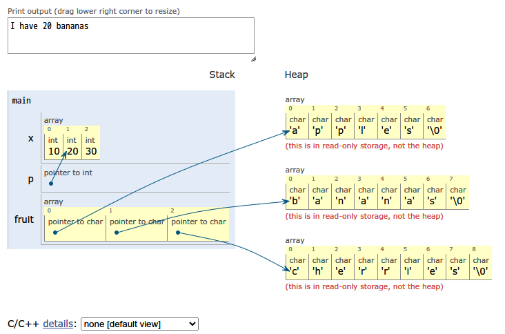
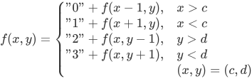
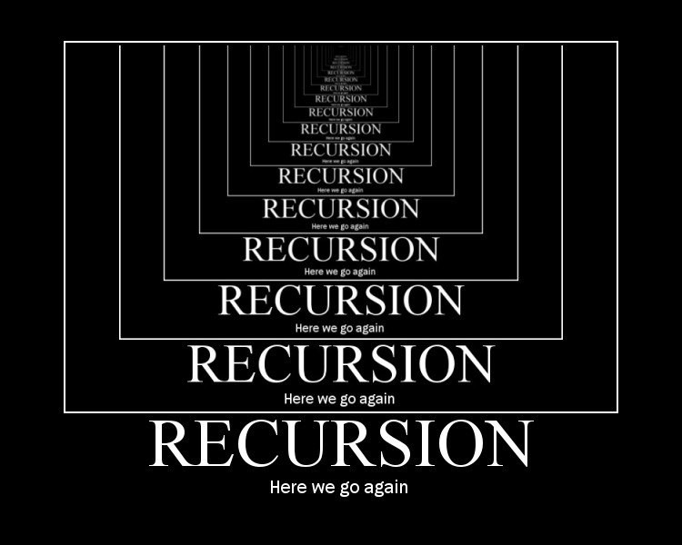

{
    "author": {
        "name": "晓阳，wenjing233",
    },
    "departments": [
        {
            "name": "NekoBytes",
            "url": "https://github.com/E1PsyCongroo/NekoBytes-TheMissing",
            "img": "./static/hdu-cs-wiki.svg"
        }
    ]
}
+++++

# 算法导论

---

## 基本语法回顾——2048 为例

> 获取本讲代码: <https://e1psycongroo.github.io/NekoBytes-TheMissing/_site/resources/Lecture4/Codes/>
>
> 高效学习: 一个[可视化 C 语言语句的小工具](https://pythontutor.com/c.html#mode=edit)



----

## 回顾抽象

```c
/* Direction 为自定义 enum 类型, 用于表示方向
 * 你可以简单将其理解为
 * Direction dir; <=> int dir;
 * #define UP 0
 * #define DOWN 1
 * #define LEFT 2
 * #define RIGHT 3
 * #define NONE 4
 */
enum Direction{UP, DOWN, LEFT, RIGHT, NONE};
// board 用于结构化存储 2048 的数据
#define BOARD_SIZE 4
int board[BOARD_SIZE][BOARD_SIZE];
```

----

## [enum 枚举类型](https://zh.cppreference.com/w/c/language/enum)

枚举类型是独立的类型，其值为包含所有其显示命名的常量（枚举常量）的底层类型（例如默认的int）的值。

需要注意，枚举类型与一般的基本类型不同，枚举类型程序员通过 enum 关键字**自定义**的一种类型。

你可以通过下面这种方式使用枚举类型:

```c
/* 定义枚举类型 color_t 该类型有三种取值:
 * RED(0), GREEN(1), BLUE(2)
 * 枚举常量是自动递增的
 */
enum color_t {RED, GREEN, BLUE};
// 定义 color_t 类型的变量 color, 初始化为 RED(0)
enum color_t color = RED;
```

++++

## enum 枚举类型

```c
#include <stdio.h>
int main(void) {
  // 你可以通过'='在枚举常量后面指定枚举值对应的底层类型的值
  enum TV { FOX = 11, HBO = 22, MAX = 30, NBC = 32 };
  printf("List of cable stations:\n");
  printf(" FOX: \t%2d\n", FOX);
  printf(" HBO: \t%2d\n", HBO);
  printf(" MAX: \t%2d\n", MAX);
}
```

```shell
List of cable stations:
  FOX:   11
  HBO:   22
  MAX:   30
```

一般枚举可以作为常量定义的一种方式，可以愉快的与`switch`搭配使用，提升代码可读性。

----

## 回顾抽象

```c
/* 核心组件 */
void run_game(void);
void initialize_board(void);
void generate_number(void);
enum Direction choose_direction(void);
void print_board(void);
bool is_finished(void);
/* move and merge logic */
bool move_and_merge_left(void);
bool move_and_merge_right(void);
bool move_and_merge_up(void);
bool move_and_merge_down(void);
```

++++

## 回顾抽象

通过抽象，我们在没有实现具体功能函数的情况下，率先实现了游戏的整体逻辑代码:

```c
void run_game(void) {
  enum Direction direction; bool generate_flag = true;
  initialize_board(); generate_number(); print_board();
  do {
    if (generate_flag) { generate_number(); }
    print_board();
    while ((direction = choose_direction()) == NONE);
    switch (direction) {
    case UP: generate_flag = move_and_merge_up(); break;
    case DOWN: generate_flag = move_and_merge_down(); break;
    case LEFT: generate_flag = move_and_merge_left(); break;
    case RIGHT: generate_flag = move_and_merge_right(); break;
    }
  } while (!is_finished());
}
```

----

## 语法回顾: 循环

```c
/* for 循环
 * for (init; condition; update) { statements; }
 * for (1*, 2, 4) { 3 }, *表示只允许一次
 * 当 2 不满足条件时, 循环终止
 * 通过循环, 用 i 表示行, j 表示列
 * 我们可以很轻松实现 initialize_borad 的逻辑
 */
void initialize_board(void) {
  for (int i = 0; i < BOARD_SIZE; i++) {
    for (int j = 0; j < BOARD_SIZE; j++) {
      board[i][j] = 0;
    }
  }
}
```

++++

## 语法回顾: 循环

```c
/* is_finished: 判断游戏结束
 * 出于简化实现的目的, 我们简单化了终止条件的判断:
 *  1. 出现 2048
 *  2. 只要游戏板被填满
 */
bool is_finished(void) {
  bool flag_no_space = true;
  for (int i = 0; i < BOARD_SIZE; i++) {
    for (int j = 0; j < BOARD_SIZE; j++) {
      if (board[i][j] == 2048) { return true; }
      if (board[i][j] == 0) { flag_no_space = false; }
    }
  }
  return flag_no_space;
}
```

----

## 语法回顾: 标准库

```c
// 使用 stdlib.h 提供的 rand 函数生成随机数, RTFM: man 3 rand
void generate_number(void) {
  int empty_space[BOARD_SIZE * BOARD_SIZE][2];
  int count = 0;
  for (int i = 0; i < BOARD_SIZE; i++) {
    for (int j = 0; j < BOARD_SIZE; j++) {
      if (board[i][j] == 0) {
        empty_space[count][0] = i; empty_space[count][1] = j;
        count++;
      }
    }
  }
  if (count > 0) {
    int index = rand() % count;
    int x = empty_space[index][0], y = empty_space[index][1];
    board[x][y] = (rand() % 2 + 1) * 2;
  }
}
```

++++

## 语法回顾: switch

```c
/* switch (expr) {
 * case const_val1: statement1; break;
 * case const_val2: statement2; break;
 * case default: statement0; break;
 * }
 * switch 匹配与 expr 相等的常量表达式并跳转继续执行语句
 * 直到遇到 `break;` 或遇到 switch 语句结束 `}`
 */
enum Direction choose_direction(void) {
  char dir = getchar();
  switch (dir) {
  case 'A': case 'a': return LEFT;
  case 'W': case 'w': return UP;
  case 'S': case 's': return DOWN;
  case 'D': case 'd': return RIGHT;
  default: return NONE;
  }
}
```

++++

## 语法回顾: printf

```c
/* 打印游戏板画面 RTFM: mam system, man clear
 * system: 用于在 C 语言程序中执行终端命令
 * clear 用于终端清屏
 */
void print_board(void) {
  system("clear");
  printf("-------------------------\n");
  for (int i = 0; i < BOARD_SIZE; i++) {
    putchar('|');
    for (int j = 0; j < BOARD_SIZE; j++) {
      if (board[i][j] != 0) {
        printf("%5d|", board[i][j]);
      } else { printf("     |"); }
    }
    putchar('\n');
  }
  printf("-------------------------\n");
}
```

++++

## 语法回顾: 指针

```c
/* 指针: 存储内存地址的值的变量, 指针类型记录被指对象的类型
 * C 语言函数参数遵循 `按值传递` 的规则
 * 函数仅持有传入参数的值和类型, 不包含传入对象的名称和地址信息
 * 通过将变量的地址的值 `按值传递` 给 swap 函数
 * 使得 int 指针 a, b 能够访问调用方的对象
 * 借助中间变量 int tmp; 实现对象值交换
 */
void swap(int *a, int *b) {
  int tmp = *a;
  *a = *b;
  *b = tmp;
}
```

++++

## 核心算法

```c
/* 函数将操作拆分为两步, 向左移动与向左合并
 * moved_flag: 用于判断是否进行移动, 返回给调用方
 * 2048 的合并逻辑注释事项:
 * | 4 | 4 | 4 | 4 | 左合并的结果应该为 | 8 | 8 | 0 | 0 |
 */
bool move_and_merge_left(void) {
  bool moved_flag = false;
  for (int row = 0; row < BOARD_SIZE; row++) {
    for (int col = 0; col < BOARD_SIZE - 1; col++) {
      if (board[row][col] == 0) {
        // 移动逻辑: for 循环检测空白就将右边的数交换过来
        for (int search_col=col+1;search_col<BOARD_SIZE;++search_col) {
          if (board[row][search_col] != 0) {
            swap(&board[row][col], &board[row][search_col]);
            moved_flag = true; break;
          }
        }
      }
```

++++

## 核心算法

```c
      // 合并逻辑: 循环检测两个相邻(无视空格)的数, 如果相等就合并
      int next_not_zero_col = col + 1;
      while (board[row][next_not_zero_col] == 0 &&
             next_not_zero_col < BOARD_SIZE)
        next_not_zero_col++;
      if (next_not_zero_col < BOARD_SIZE &&
          board[row][col] == board[row][next_not_zero_col]) {
        moved_flag = true; board[row][col] *= 2;
        board[row][next_not_zero_col] = 0;
      }
    }
  }
  return moved_flag;
} /* 其余移动处理函数类似, 不再在此展示 */
```

> 程序 = 数据结构 + 算法。事实上这个最简单的应用程序: 2048，已经包含了数据结构(数组)和基本的算法(循环迭代)。

----

## 数据结构

数据结构是程序组织结构化数据的一种方式，数组作为一种基础的数据结构被广泛应用。

想象一下 C 语言如果没有数组，这意味着: 如果你需要表示一连串的数值，那么你需要对所有的数值变量进行声明`int a1, a2, a3...;`。

常见的数据结构还有:

1. 栈
2. 队列
3. 链表
4. 树

目前你掌握到的数据结构只有数组，但这就足够了，让我们先把数据结构放到一边，让我们先来探讨一下算法。

---

## 认识算法

> “无论硬件给了你多少性能，软件都会把它拿走！”
>
> 比如 Android 的内存永远不够用，明明大家都是 Unix

随着硬件的不断提升，计算机的效率得到了显著的提高。

然而，这不能改变我们对更优秀的算法的渴求，因为计算机的资源终究是有限的。

一味的追求硬件上的提升，而放弃算法上的精进，首先会遇到严重的边际效应

其次，硬件和算法实际上是相辅相成的，算法的演化往往会带动硬件厂商去制作更适配该算法的硬件

例如针对深度学习等算法对矢量计算的高度依赖，现代CPU引入了向量化指令集，也有GPU架构为了支持高效的矢量计算而设计（例如CUDA）

++++

## 什么是[算法](https://zh.wikipedia.org/zh-sg/%E7%AE%97%E6%B3%95)

> 把大象塞进冰箱需要几步？

1. 算法是将**输入**变为**输出**的**有限**操作序列。
2. 算法要解决的问题不是特定的实例，而是广泛的抽象存在。
3. 算法的行为能够进行**精确的描述**，并可以通过数学方法**证明**。

----

## 描述算法

算法是对如何解决问题的描述,描述算法就是描述如何去解决一个问题。

例如有人问你,如何从文泽路地铁站走到杭电生活区。

你回答道：“向北走,到达弗雷德广场后,向西走。”

可以说这也是一种算法,当然在实际生产活动中,我们遇到的问题往往更加抽象。

比如: 如何从地理位置上的 x 点走到 y 点？

++++

## 描述算法

问题背景：给定一张网格图,向右为x轴正方向,向上为y轴正方向,在格点处可以上下左右移动至临近格点

问题输入：起点坐标(a,b)终点坐标(c,d)

问题输出：一种从起点前往终点的方案,以字符串表示操作序列(0:上 1:下 2:左 3:右)

++++

## 文字描述

当前坐标与终点坐标重合时,算法结束

当前坐标位于终点坐标下方时,向上走

当前坐标位于终点坐标上方时,向下走

当前坐标位于终点坐标右侧时,向左走

当前坐标位于终点坐标左侧时,向右走

可以发现这样的描述相当冗长且不严谨,在实践中,除了向别人解释某种算法,我们不会使用这种方式。

> 例如经典的程序员笑话: 女朋友说,下班回来带一个西瓜。如果看到番茄,就买两个。于是程序员买回来的是两个西瓜。

++++

## 数学描述

设$f(x,y)$为从坐标$(x,y)$出发,到终点的合法操作序列



这是较为常见的描述方式,实际的描述会比上文更加严谨,当算法描述到这一步时,离实现基本不远了

++++

## 伪代码描述

通过类似代码的文字语言描述算法执行的过程

```txt
findPath(a, b, c, d):
    如果 (a, b) == (c, d):
        返回 ""  // 到达终点,返回空字符串
    操作序列 = ""
    如果 a > c:
        操作序列 += "0"  // 向上走
        返回 操作序列 + findPath(a - 1, b, c, d)
    如果 a < c:
        操作序列 += "1"  // 向下走
        返回 操作序列 + findPath(a + 1, b, c, d)
    如果 b > d:
        操作序列 += "2"  // 向左走
        返回 操作序列 + findPath(a, b - 1, c, d)
    如果 b < d:
        操作序列 += "3"  // 向右走
        返回 操作序列 + findPath(a, b + 1, c, d)
```

----

## 正整数的高精度乘法

众所周知，C语言中的整数类型能存储的类型是有限制的

假设我现在希望得到1000位的正整数与1000位的正整数相乘的结果

我们能否设计一个相应的算法呢

简单的，我们联想到小学生都会的竖式乘法

发现这个算法对数字的位数不存在限制

考虑在计算机中设计算法来模拟这一过程

## 拆解问题

1. 输入
2. 拆分数字到各位
3. 竖式乘法
4. 输出

++++

## 子问题A——拆分数字

```txt
split_number(整数 x) 返回 数字序列:
    如果 x 等于 0:
        返回 {0}

    创建数字序列 arr

    // 将 x 的每一位数字存入数字序列 arr
    循环 当 x 不等于 0:
        将 x取余10 的值存入数字序列 arr
        将 x 设为 x整除10 的值

    返回 数字序列 arr
```

++++

## 子问题B——竖式乘法

```txt
multiply(数字序列 x, 数字序列 y) 返回 数字序列:
    创建数字序列 z, 长度为 x 的长度 + y 的长度
    // 初始化数字序列 z 的所有元素为 0
    循环 对于每个元素 i 从 0 到 z 的长度 - 1:
        设置 z[i] 为 0
    // 进行乘法运算
    循环 对于每个元素 i 从 0 到 x 的长度 - 1:
        循环 对于每个元素 j 从 0 到 y 的长度 - 1:
            z[i + j] += x[i] * y[j]
    // 处理进位
    循环 对于每个元素 i 从 0 到 z 的长度 - 2:
        z[i + 1] += z[i] 整除 10
        z[i] = z[i] 取余 10
    // 去除前导零
    循环 当 z 的最后一个元素为 0 且 z 的长度大于 1:
        数字序列z的长度 减少 1
    返回数字序列 z
```

---

## CAT BREAK


---

## [函数](https://zh.cppreference.com/w/c/language/functions)详解

函数是将一个标识符（函数名）关联到一条复合语句（函数体）的 C 语言构造。每个 C 程序都从 main 函数开始执行，也从它或者调用其他用户定义函数或库函数终止。

```c
// main 函数的定义
int main(void) {
    int sum(int, int); // 函数声明（可以出现于任何作用域）
    sum(1, 2); // 函数调用
}
// 函数定义
int sum(int a, int b) {
    return a + b;
}
```

函数由函数声明或函数定义引入。

函数可以拥有零或更多个形参，它们由函数调用运算符的实参所初始化，并且以通过其 return 语句向其调用者返回一个值。

----

## 函数的定义

```c
<return type> function_name(<type_1> parament_1, ...) {
    statements;
    return something or nothing;
}
```

任何时候，当你在当前函数的作用域中调用return，都代表程序的结束。return的类型需要与函数声明一致。（如果函数类型为void，可省略/调用return;）

对于有返回值的函数，如果在函数结束时仍没有执行return，**可能会引发UB行为**。

++++

## [main 函数](https://zh.cppreference.com/w/c/language/main_function)

```c
int main (void) { body }
int main (int argc, char *argv[]) { body }
/* 其他由实现定义的签名 (C99 起) */
int main (int argc, char *argv[], char *envp[]) { body }
```

每个要在宿主环境运行的编码 C 程序都含有名为 main 的函数定义（非原型），它是程序中所指定的起始点。

使用参数的main函数编译生成的可执行文件在执行时可以接受命令行参数

++++

## main 函数

让我们来实践一下：

```c
/* example.c */
#include <stdio.h>
int main(int argc, char *argv[]) {
    printf("Number of arguments: %d\n", argc);
    for (int i = 0; i < argc; i++) {
        printf("Argument %d: %s\n", i, argv[i]);
    }
    return 0;
}
```

1. 目录下命令行输入编译指令：gcc -o example example.c
2. 目录下命令行输入运行指令：./example arg1 arg2 arg3

----

## 函数的作用

在实际的编程中，你的函数可能有以下作用：

- 对经常复用的代码的封装，使你的程序主体更加简洁。
- 依旧是对代码的封装，但是传入参数与传出参数之间存在关联性，作为一种问题解决方案的抽象。
- 作为解决问题的一种不可代替的手段，例如递归函数。

----

## 函数的抽象意义

对于函数的使用者，函数的抽象含义为：

- 在调用该函数后，便会给出符合函数功能的结果
- 函数的使用者不需要清楚函数内部发生了什么，而是将其当作黑盒使用
- 例如printf是C标准库的一个函数，当我们使用它时，不需要了解它是如何实现的

对于函数的维护者，函数的抽象含义为：

- 在维护该函数时，其不需要了解使用者是在什么环境下调用该函数，只需要关注参数即可
- 函数的工作区域仅在函数内部，与外部作用域无关，互不干扰

可以说，计算机科学中的抽象是一种信息分层，对象主体只需要在所在的信息层面工作，这保证了信息的安全性和有效性

---

## 递归



----

## 什么是递归

我们常在主函数中调用各种函数（当然，你不能调用主函数，主函数只有在程序开始被执行时才会被调用）

显然，我们也可以在函数中调用函数——包括自己

函数调用自己的行为被泛称为递归，例如：

```c
void f() {
  printf("人类的本质是{");
  f();
  printf("}");
}
```

--

这是一个无限递归的函数，它将迅速地耗尽栈空间，并引发stack overflow的错误

----

## Extra：递归与栈

众所周知，函数保有其自身的局部变量，当函数被调用时，内存会为函数调用开辟一片空间用于存储函数的局部数据，并在函数返回后将空间清除。

考虑一个函数调用情况: main -> f -> g -> h

那么对应的返回情况为: exit <- main <- f <- g <- h

可以看到，对函数的处理具有`先进后出`的性质: 最先调用的函数在最后返回。

我们一般将拥有`先进后出`性质的数据结构称为，**栈**。

内存中用于程序执行存储函数局部数据的内存部分也就被我们称为**栈内存**（简称**栈**）。

显而易见，无限递归的函数将迅速消耗你的栈空间并被操作系统检测引发错误。

----

## 斐波那契数列

以斐波那契为例，考虑到斐波那契数列的每一项都等于前两项之和，我们得到以下代码：

```c
int f(int n) { return f(n - 2) + f(n - 1); }
```

考虑函数的抽象含义，我们认为f(n-2)与f(n-1)就是前两项

--

但考虑到n=1与n=2时，项数的值是已知的，于是我们修改代码:

```c
int f(int n) {
  if (n <= 2) return 1;
  return f(n - 2) + f(n - 1);
}
```

----

## 设计递归算法

在算法导论中，作者将设计递归算法的过程总结为三步：

1. 拆解：将原问题拆解为多个子问题，子问题与原问题为同类型的问题且规模更小
    - 当n>2时，求解f(n)即求解f(n-2)与f(n-1)
2. 求解：将子问题视作新的原问题并重复上一步，若无法重复则说明子问题是不可拆解的原子问题，直接尝试求解
    - 当n<=2时，直接求解
    - 当n>2时，继续拆解问题
3. 合并：将子问题的解对原问题的解的贡献进行合并，得到原问题的解
    - 原问题的解等于子问题的解的和

----

## 递归的作用

事实上，递归算法并非不可替代: 所有的递归算法，都可以通过循环实现。

然而，递归有着以下优点：

1. 简洁优雅：参数通过系统隐式传递，无需程序员考虑空间分配，无需大量临时变量存储数据，用抽象壁垒守护程序员的心智。
2. 舒适自然：许多问题天然的具有可递归的性质，例如树的遍历问题等。
3. 赏心悦目：递归代码普遍较短，让人感受人类的智慧。

> 理解抽象，学会递归，才算真正的编程入门

----

## 递归典范——归并排序

排序作为计算机科学的基本问题，对于不同的应用场景都有不同的适用算法，下文将介绍一种对递归进行典型利用的算法——归并排序

### 问题描述

输入：n个数字的序列(a1,a2...,an)

输出：输入序列的重排(a1',a2'...an')，满足a1'<=a2'<=...<=an'

----

## 合并

对于这个问题，我们反过来思考，对于怎样的子问题，我们可以通过子问题得到的解得到原问题的解

假设我们现在有两段已经排序好的序列[l...r] [p..q]，我们能否在较短的时间内将两段序列中的所有数字排序成一个新序列呢？

考虑算法：

- 在两段序列非空时，比较开头元素，将较小的元素放到新序列尾部
- 有一段序列为空时，将非空序列的所有元素依序放到新序列尾部
- 当两段序列皆空时，算法结束

++++


----

## 拆解

在知道什么样的子问题可以求解原问题后，将原问题拆成子问题便简单了，只要将原序列拆成恰好连续的两部分即可

考虑到复杂度问题，我们将序列对半分

称当前需要排序的序列为[l...r]

则取l,r中点mid，将序列拆为：[l...mid] [mid+1...r]

## 求解

当前序列为空或只有一个元素时，则当前序列无需排序，直接回溯

反之，将当前问题进行分解

----

## 伪代码

```txt
merge_sort(数组 arr):
    如果 arr 的长度小于等于 1:
        返回 arr

    // 找到中间索引
    mid = arr.length / 2

    // 递归地对左右子数组进行归并排序
    左半部分 = merge_sort(arr[0:mid])
    右半部分 = merge_sort(arr[mid:arr.length])

    // 合并已排序的子数组
    返回 merge(左半部分，右半部分)

```

++++

## 伪代码

```txt
merge(数组 left, 数组 right):
    创建一个空数组 result
    初始化指针 i 和 j 为 0
    // 合并两个已排序的数组
    循环 当 i < left.length 且 j < right.length:
        如果 left[i] 小于等于 right[j]:
            将 left[i] 添加到 result
            i 增加 1
        否则:
            将 right[j] 添加到 result
            j 增加 1
    // 添加剩余的元素
    循环 当 i < left.length:
        将 left[i] 添加到 result
        i 增加 1
    循环 当 j < right.length:
        将 right[j] 添加到 result
        j 增加 1
    返回 result
```

----

## 图示


---

## Extra: 复杂度分析

我们常说算法的效率很重要, 算法的效率可以分为时间效率和空间效率

在描述问题时, 我们常用字母n描述问题的规模

算法的时间复杂度是指算法运行时间随着输入规模增长而变化的趋势.

我们通常用大O符号（Big O notation）来表示时间复杂度.

大O符号表示的是算法运行时间的上界, 也就是最坏情况下的时间复杂度.

它忽略常数因子和低阶项, 只关注最高阶项.

例如:

- $O(1)$是指该算法与输入规模无关, 为常数复杂度
- $O(n)$指该算法时间复杂度与输入规模成正比

----

## 归并排序与冒泡排序的算法复杂度比较

对于初学者而言, 第一个接触的排序算法通常是冒泡排序, 它的代码如下:

```c
void bubble_sort(int *arr,int n){
    int i,j,tmp;
    for(i=0;i<n;i++){
        for(j=n-1;j>i;j--){
            if(arr[j]<arr[j-1]){
                tmp=arr[j-1];
                arr[j-1]=arr[j];
                arr[j]=tmp;
            }
        }
    }
}
```

显然, 这个算法有一个由两个循环组成的嵌套循环, 每个循环的时间复杂度都与n相关, 所以该算法是$O(n^2)$的存在的

++++

## 归并排序与冒泡排序的算法复杂度比较

反观归并排序, 他的代码可能为：

```c
void merge_sort(int *arr, int l, int r) {
  if (l >= r)
    return;
  int mid = (l + r) / 2;
  merge_sort(arr, l, mid); merge_sort(arr, mid + 1, r);
  int buffer[r-l+1];
  int len = 0;
  int i = l, j = mid + 1;
  while (i <= mid && j <= r) {
    buffer[len++] = arr[i] < arr[j] ? arr[i++] : arr[j++];
  }
  while (i <= mid) { buffer[len++] = arr[i++]; }
  while (j <= r) { buffer[len++] = arr[j++]; }
  memcpy(arr + l, buffer, sizeof(int) * len);
  return;
}
```

++++

函数主体有三个循环, 皆与n相关, 而且函数自己还会调用自己, 复杂度看起来比冒泡排序还高

然而通过分析，我们其实可以知道归并排序的时间复杂度为$O(nlog(n))$

让我们以n=10000的数据进行一次测试：

```shell
mergesort cost 0.002185 second on datasize[10000]
bubblesort cost 0.290680 second on datasize[10000]
```

---

## 我想学算法

1. 经典书籍: [算法导论](https://zh.wikipedia.org/wiki/%E7%AE%97%E6%B3%95%E5%AF%BC%E8%AE%BA)
2. Stanford的算法入门(C++实现): [CS 106B](https://web.stanford.edu/class/cs106b/)，宝宝巴士
3. UCB的算法入门(Java实现): [CS 61B](https://fa24.datastructur.es/)，偏工程
4. MIT的典中典: [MIT 6.006](https://ocw.mit.edu/courses/6-006-introduction-to-algorithms-fall-2011/), [MIT 6.046](https://ocw.mit.edu/courses/6-046j-design-and-analysis-of-algorithms-spring-2015/)，偏理论
5. Coursera: [Algorithm I](https://www.coursera.org/learn/algorithms-part1), [Algorithm II](https://www.coursera.org/learn/algorithms-part2)，高质量网课
