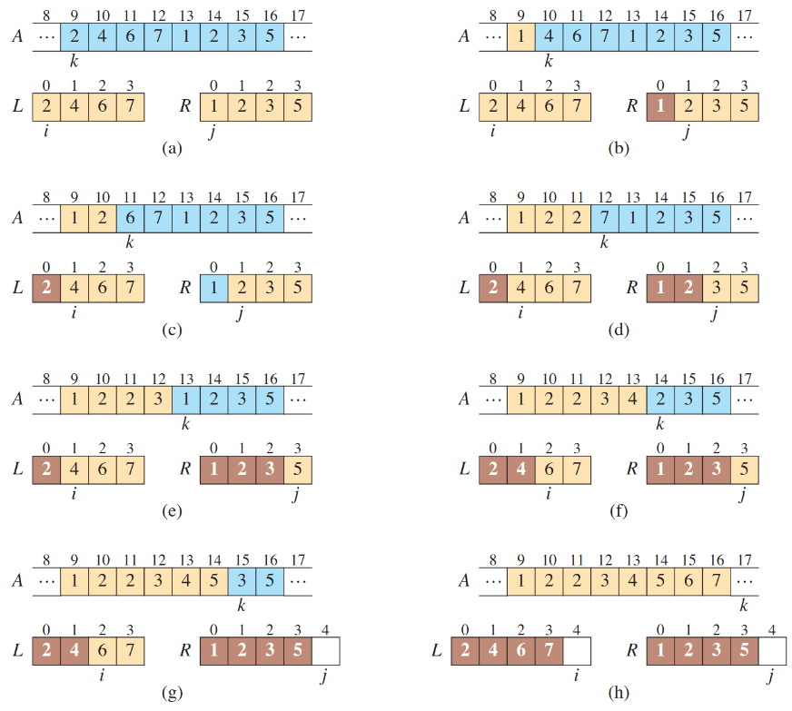

# 认识算法
## 什么是算法
> Informally, an algorithm is any well-deûned computational procedure that takes some value, or set of values, as input and produces some value, or set of values, as output in a ûnite amount of time. An algorithm is thus a sequence of computational steps that transform the input into the output.
算法是解决问题的工具，算法需要处理满足问题约束条件下任意的输入组并给出对应的输出组。
具体而言，算法是将输入变为输出的操作序列
## 什么是算法要解决的问题
> The statement of the problem speciûes in general terms the desired input/output relationship for problem instances, typically of arbitrarily large size.
问题是指对期望输入输出之间关系的抽象描述
这样的描述往往对任意输入规模的数据包括大规模数据都生效
## 算法的需求
> When you design and analyze algorithms, you need to be able to describe how they operate and how to design them. You also need some mathematical tools to show that your algorithms do the right thing and do it efûciently.
在设计一个算法时，你首先要对算法的行为进行精确的描述
其次要通过数学证明等手段说明算法的正确性，即可以通过给定输入得到正确的结果
## 如何描述算法
算法是对如何解决问题的描述,描述算法就是描述如何去解决一个问题  
例如有人问你,如何从文泽路地铁站走到杭电生活区
你回答道：向北走,到达弗雷德广场后,向西走
可以说这也是一种算法,当然在实际生产活动中,我们遇到的问题往往更加抽象

例如：
问题背景：给定一张网格图,向右为x轴正方向,向上为y轴正方向,在格点处可以上下左右移动至临近格点
问题输入：起点坐标(a,b)终点坐标(c,d)
问题输出：一种从起点前往终点的方案,以字符串表示操作序列(0:上 1:下 2:左 3:右)

这个问题非常简单,相信解决这个问题的算法已经在读者的大脑中呈现了,下面我将使用比较常见的方式来呈现这个算法
### 文字描述
当前坐标与终点坐标重合时,算法结束
当前坐标位于终点坐标下方时,向上走
当前坐标位于终点坐标上方时,向下走
当前坐标位于终点坐标右侧时,向左走
当前坐标位于终点坐标左侧时,向右走

可以发现这样的描述相当冗长且不严谨,在实践中,除了向别人解释某种算法,我们不会使用这种方式
例如经典的程序员笑话：
女朋友说,下班回来带一个西瓜。如果看到番茄,就买两个。
于是程序员买回来的是两个西瓜。
### 数学描述
$$ 设f(x,y)为从坐标(x,y)出发,到终点的合法操作序列,类型为支持使用加法拼接的字符串 $$
$$
f(x,y)=
\begin{cases}
"0"+f(x-1,y) & x>c
 \\"1"+f(x+1,y) & x<c
 \\"2"+f(x,y-1) & y>d
 \\"3"+f(x,y+1) & y<d
 \\"" & (x,y)==(c,d)
\end{cases}
$$
这是较为常见的描述方式,实际的描述会比上文更加严谨,当算法描述到这一步时,离实现基本不远了
### 伪代码描述
```
函数 findPath(a, b, c, d):
    如果 (a, b) == (c, d):
        返回 ""  // 到达终点,返回空字符串

    操作序列 = ""

    如果 a > c:
        操作序列 += "0"  // 向上走
        返回 操作序列 + findPath(a - 1, b, c, d)

    如果 a < c:
        操作序列 += "1"  // 向下走
        返回 操作序列 + findPath(a + 1, b, c, d)

    如果 b > d:
        操作序列 += "2"  // 向左走
        返回 操作序列 + findPath(a, b - 1, c, d)

    如果 b < d:
        操作序列 += "3"  // 向右走
        返回 操作序列 + findPath(a, b + 1, c, d)
```
当算法完备到这个程度时,只要你熟悉语法,想必实现算法便不是什么难事,这也便是为何这节课安排在week4的原因了
（相信你已经学会C语言了,让我们来解决这个问题试试吧）
## 为什么我们需要算法
>Of course, computers may be fast, but they are not inûnitely fast. Computing time is therefore a bounded resource, which makes it precious. Although the saying goes, Time is money,time is even more valuable than money: you can get back money after you spend it, but once time is spent, you can never get it back. Memory may be inexpensive, but it is neither inûnite nor free. You should choose algorithms that use the resources of time and space efûciently
随着硬件的不断提升，计算机的效率得到了显著的提高。
然而，这不能改变我们对更优秀的算法的渴求，因为计算机的资源终究是有限的。
一味的追求硬件上的提升，而放弃算法上的精进，首先会遇到严重的边际效应（就好像周长不变的情况下，面积最大的长方形是正方形）
（看看牙膏厂吧，家人们，硬件那么好提升为啥还要挤牙膏）
其次，硬件和算法实际上是相辅相成的，算法的演化往往会带动硬件厂商去制作更适配该算法的硬件
例如针对深度学习等算法对矢量计算的高度依赖，现代CPU引入了向量化指令集，也有GPU架构为了支持高效的矢量计算而设计（例如CUDA）
就我们身边而言，你每次真金白银升级的硬件，最后的结局往往是被软件开发者浪费，说的就是浪费内存和电量微信，以及之前每次更新不清除老数据浪费存储空间的原神（听说现在改了，不知道阿，我不玩原神）
_“无论硬件给了你多少性能，软件都会把它拿走！”_
## 算法举例——正整数的高精度乘法
### 问题背景
众所周知，C语言中的整数类型能存储的类型是有限制的
假设我现在希望得到1000位的正整数与1000位的正整数相乘的结果
我们能否设计一个相应的算法呢
### 问题描述 
输入：正整数x,y
输出：x*y的结果
### 整体思路
简单的，我们联想到小学生都会的竖式乘法
发现这个算法对数字的位数不存在限制
考虑在计算机中设计算法来模拟这一过程
### 拆解问题
1. 输入
2. 拆分数字到各位
3. 竖式乘法
4. 输出
#### 子问题A——拆分数字
输入：正整数x
输出：从低位向高位顺序的各位数字组成的序列
思路：使用取余获取当前个位，使用整除（C语言中整数对整数做除法自动舍去小数位）
代码（出于后续实现的便利性，还将传回序列的长度）:
```c
struct Array{
    int len;
    int *a;
};
typedef struct Array array;
array split_number(int x){
    if(x==0){
        int *a=(int *)malloc(sizeof(int));
        a[0]=0;
        return (array){1,a};
    }
    int tmp=1,len=0;
    while(tmp<=x){
        tmp*=10;
        len++;
    }
    int *a=malloc(sizeof(int)*len),cnt=0;
    while(x){
        a[cnt++]=x%10;
        x/=10;
    }
    return (array){len,a};
}
```
#### 子问题B——竖式乘法
输入：拆分数字得到的序列x与y
输出：计算结果z
思路：创建序列a存储运算结果，枚举两段序列的各个元素，并将相乘的结果存入a，最后对序列a进行进位处理
代码（出于简化目的直接将z输出）：
```c
void mutiply(array x,array y){
    array z;
    z=(array){x.len+y.len,(int *)malloc(sizeof(int)*(x.len+y.len))};
    memset(z.a,0,sizeof(int)*z.len);
    iny i,j;
    for(i=0;i<x.len;i++){
        for(j=0;j<y.len;j++){
            z.a[i+j]+=x.a[i]*y.a[j];
        }
    }
    for(i=0;i<z.len-1;i++){
        z.a[i+1]+=z.a[i]/10;
        z.a[i]%=10;
    }
    while(z.a[z.len-1]==0) z.len--;
    for(i=z.len-1;i>=0;i--){
        printf("%d",z.a[i]);
    }
    printf("\n");
    free(z.a);//哦老天，想想这是为什么
    return;
}
```
# 认识函数
## 什么是函数
上面的代码也许存在很多你看不懂的地方，这些知识我们会在之后的学习中慢慢涉及
最明显的一点，我们发现我们的代码不再写在int main()中，而是类似int main(){}的存在中
事实上，这些东西以及int main都是C语言中的函数，int main()是最特殊的函数被称为主函数
在数学中，函数在数学中，函数是一个关系，它将一个集合中的每个元素（称为自变量或输入）映射到另一个集合中的唯一元素（称为因变量或输出）。
函数通常用符号表示，如$f(x)$，其中 $f$是函数名，$x$是自变量。
而在C语言中，函数也可以是一种映射关系，例如上文的两个函数的结果都仅与传入参数有关，并且输入输出满足了某种关系
但是更多时候C语言的函数更像一种过程，仅仅只是对代码的封装，可以等价的展开到引用函数处
许多语言严格的将过程与函数严格的区分开来，例如Pascal使用关键字function与procedure进行区分
至于C，你可以认为没有返回值的函数就是过程
## 函数的定义
```c
<return type> function_name(<type_1> parament_1,<type_2> parament_2 ...){
    do somthing...
    return something or nothing;
}
```
例如对于main函数而言，其返回类型为int
*（C标准规定其类型必须为int，虽然事实上很多类型也能通过编译，例如signed，但是我们不推荐你这么做）*
当其返回值为0时，表示程序正常结束，当返回值不为0时，表示程序没有正常结束
同样main函数也可以有传入参数，根据C标准，其传入参数要么为空，要么为(int argc, char *argv[]) 
让我们来实践一下：
1. 在你的工作目录中创建文件example.c
2. 写入：
    ```c
    #include <stdio.h>
    int main(int argc, char *argv[]) {
        printf("Number of arguments: %d\n", argc);
        for (int i = 0; i < argc; i++) {
            printf("Argument %d: %s\n", i, argv[i]);
        }
        return 0;
    }   
    ```
3. 目录下命令行输入编译指令：gcc -o example example.c
4. 目录下命令行输入运行指令：./example arg1 arg2 arg3
## 函数的作用
在实际的编程中，你的函数可能有以下作用：
1. 对经常复用的代码的封装，使你的程序主体更加简洁
2. 依旧是对代码的封装，但是传入参数与传出参数之间存在关联性，作为一种问题解决方案的抽象
3. 作为解决问题的一种不可代替的手段，例如递归函数
## 函数的抽象意义
当函数作为处理问题的工具时
对于函数的使用者，函数的抽象含义为：
    在调用该函数后，便会给出符合函数功能的结果
    函数的使用者不需要清楚函数内部发生了什么，而是将其当作黑盒使用
    例如printf是C标准库的一个函数，当我们使用他时，不需要了解它是如何实现的
对于函数的维护者，函数的抽象含义为：
    在维护该函数时，我不需要了解使用者是在什么环境下被调用
    函数的工作区域仅在函数内部，我只需要知道输入就能给出对应的输出
可以说，计算机科学中的抽象是一种信息分层，对象主体只需要在所在的信息层面工作，保证信息的安全性和有效性
## 函数式编程
在函数被提出后，函数式编程便应运而生
函数式编程有以下特点：
1. 在函数式编程中，函数被视为第一公民，函数可以作为函数的参数，函数的返回值可以是函数，函数可以被存储在变量中
2. 数据具有不可变性，一旦一个参数与值绑定，便不可再修改
3. 为了解决上面的约束，常使用递归的方法
例如在C语言中，如果使用迭代的方式计算斐波那契数列的第n项，代码可能为：
```c
int f(int n){
    if(n<=2) return 1;
    int a=1,b=1,c=0,i;
    for(i=3;i<=n;i++){
        c=a+b;
        a=b;
        b=c;
    }
    return c;
}
```
但是如果以函数式编程的风格去写，代码可能为：
```c
int f(int n){
    return n<=2?1:f(n-2)+f(n-1);
}
```
函数式编程具有简洁、利于理解的优点
但其在性能上存在较大的劣势
# 认识递归
## 什么是递归
我们常在主函数中调用各种函数
显然，我们也可以在函数中调用函数——包括自己
函数调用自己的行为被泛称为递归，例如：
```c
void f(){
    printf("人类的本质是{");
    f();
    printf("}")；
}
```
这是一个无限递归的函数，它将迅速地耗尽栈空间，并引发stack overflow的错误
## Extra：递归与栈
众所周知，我们的程序在编译后被转换为机器码
存在一个指令指针PC指向当前执行的机器指令，在正常执行指令后向下一条指令移动
但是当PC指向函数调用转换的机器码指令时，PC将跳转到函数的机器码位置
显然，这时我们的系统需要记录跳转前的一些值以及跳转后函数需要记录的值
这些需要临时存储的数据被放于栈中，也就是说，函数的调用必然会消耗栈空间
显而易见，无限递归的函数将迅速消耗你的栈空间并引发错误
## 如何设计递归算法
在实际生产中，我们自然不希望我们的程序是无限递归的
考虑到递归产生的资源损耗，我们希望解决问题时递归的层数越少越好，恰好能解决问题就行
仍旧以斐波那契数列为例
回想之前提及过的函数的抽象含义：作为使用者，我们假设函数会返回期望的结果而不在意其实现
考虑到斐波那契数列的每一项都等于前两项之和，我们得到以下代码：
```c
int f(int n){
    return f(n-2)+f(n-1);
}
```
考虑函数的抽象含义，我们认为f(n-2)与f(n-1)就是前两项
但考虑到n=1与n=2时，项数的值是已知的，于是我们修改代码:
```c
int f(int n){
    if(n<=2) return 1;
    return f(n-2)+f(n-1);
}
```
阿，多么的简洁，这便是递归的魅力，或许你还不明白发生了什么，让我们从算法设计者的角度来重新审视这个问题
在算法导论中，作者将设计递归算法的过程总结为三步：
1. 拆解：将原问题拆解为多个子问题，子问题与原问题为同类型的问题且规模更小
2. 求解：将子问题视作新的原问题并重复上一步，若无法重复则说明子问题是不可拆解的原子问题，直接尝试求解
3. 合并：将子问题的解对原问题的解的贡献进行合并，得到原问题的解
下文详细展开这三步在斐波那契数列问题中是如何体现的
### 拆解
当n>2时，求解f(n)即求解f(n-2)与f(n-1)
子问题与原问题为同一类型问题且规模更小
### 求解
当n<=2时，直接求解
当n>2时，继续拆解问题
### 合并
原问题的解等于子问题的解的和
## 递归树
让我们将递归调用的过程看作一棵树：

在树中，图中的单向箭头被称为单向边
在单向边连接的两个点的相对关系中
单向边的起始节点被称为父亲
单向边的中止节点被称为孩子
没有孩子的节点被称为叶子
观察上图，我们发现所有的叶子节点都是不可分割的原子问题，可以直接求解
假设PC指针在这颗"函数树"上移动，则其的行为逻辑为：
    1. 当前节点为原子问题时，直接求解（**求解**），并将指针向父亲节点移动（**回溯**）
    2. 当前节点的孩子仍未求解时，移动PC指针（**递归调用**），优先求解子问题(**拆分**)
    3. 当前节点的孩子都得解时，合并孩子解得到父亲解（**合并**），并将指针向父亲节点移动（**回溯**）
## 递归的作用
我们发现，递归算法并非不可替代：无论是我们手动模拟堆栈的行为，或是提前建立递归树在上面进行迭代
然而，递归有着以下优点：
1. 简洁优雅：参数通过系统隐式传递，无需程序员考虑空间分配，无需大量临时变量存储数据
2. 舒适自然：许多问题天然的具有可递归的性质，例如树的遍历问题等
3. 赏心悦目：递归代码普遍较短，让人感受人类的智慧
## 递归典范——归并排序
排序作为计算机科学的基本问题，对于不同的应用场景都有不同的适用算法，下文将介绍一种对递归进行典型利用的算法——归并排序
### 问题描述
输入：n个数字的序列(a1,a2...,an)
输出：输入序列的重排(a1',a2'...an')，满足a1'<=a2'<=...<=an'
### 使用分治算法的设计思路解决问题
#### 合并
对于这个问题，我们反过来思考，对于怎样的子问题，我们可以通过子问题得到的解得到原问题的解
假设我们现在有两段已经排序好的序列[l...r] [p..q]，我们能否在较短的时间内将两段序列中的所有数字排序成一个新序列呢？
考虑算法：
- 在两段序列非空时，比较开头元素，将较小的元素放到新序列尾部
- 有一段序列为空时，将非空序列的所有元素依序放到新序列尾部
- 当两段序列皆空时，算法结束
实际运行效果如图所示：

#### 拆解
在知道什么样的子问题可以求解原问题后，将原问题拆成子问题便简单了，只要将原序列拆成恰好连续的两部分即可
考虑到复杂度问题，我们将序列对半分，原因在之后解释
称当前需要排序的序列为[l...r]
则取l,r中点mid，将序列拆为：[l...mid] [mid+1...r]
#### 求解
当前序列为空或只有一个元素时，则当前序列无需排序，直接回溯
反之，将当前问题进行分解
### 代码
```c
void merge_sort(int* arr,int l,int r){
    if(l>=r) return;
    int mid=(l+r)/2;
    merge_sort(arr,l,mid);
    merge_sort(arr,mid+1,r);
    int *buffer=(int *)malloc(sizeof(int)*(r-l+1)),len=0;
    int i=l,j=mid+1;
    while(i<=mid&&j<=r){
        buffer[len++]=arr[i]<arr[j]?arr[i++]:arr[j++];
    }
    while(i<=mid){
        buffer[len++]=arr[i++];
    }
    while(j<=r){
        buffer[len++]=arr[j++];
    }
    memcpy(arr+l,buffer,sizeof(int)*len);
    free(buffer);//REMEMBER!!!
    return;
}
```
### 图示

# 简要认识时间复杂度
我们常说算法的效率很重要，算法的效率分为时间效率和空间效率
在描述问题时，我们常用字母n描述问题的规模
朴素的想法是，对于什么规模的问题，以该算法实际使用了多少运行时间来衡量算法的快慢
但这样的想法有着诸多缺点，比如：用户的硬件并不相同，以什么硬件的运行时间为基准；问题输入的数据有近乎无穷的可能，以什么样的数据下的运行时间为基准。
为此，时间复杂度的概念被引入了。
算法的时间复杂度是指算法运行时间随着输入规模增长而变化的趋势。
它并非衡量算法运行时间的绝对值（因为这取决于硬件、编译器等因素），而是一个渐进的、相对的衡量标准，描述了算法运行时间对输入规模的依赖关系。 
我们通常用大O符号（Big O notation）来表示时间复杂度。
大O符号表示的是算法运行时间的上界，也就是最坏情况下的时间复杂度。
它忽略常数因子和低阶项，只关注最高阶项。
假设某算法的时间复杂度可以用多项式：$ t(x) = x^2+x+1 $表示，再设多项式$ f(x) = x^2$，不难发现
$x=10时 t(x)=111 f(x)=100 \frac{t(x)}{f(x)} = 1.11$
$x=10000时 t(x)=100010001 f(x)=100000000 \frac{t(x)}{f(x)} = 1.00010001$
当输入规模足够大时，最高阶项对运行时间的影响是主要的。
例如O（1）是指该算法与输入规模无关，为常数复杂度
O（n）指该算法时间复杂度与输入规模成正比
## 归并排序与冒泡排序的算法复杂度比较
对于初学者而言，第一个接触的排序算法通常是冒泡排序，它的代码如下:
```c
void bubble_sort(int *arr,int n){
    int i,j,tmp;
    for(i=0;i<n;i++){
        for(j=n-1;j>i;j--){
            if(arr[j]<arr[j-1]){
                tmp=arr[j-1];
                arr[j-1]=arr[j];
                arr[j]=tmp;
            }
        }
    }
}
```
显然，这个算法有一个由两个循环组成的嵌套循环，每个循环的时间复杂度都与n相关，所以该算法是$O(n^2)$的存在的
反观归并排序：
```c
void merge_sort(int* arr,int l,int r){
    if(l>=r) return;
    int mid=(l+r)/2;
    merge_sort(arr,l,mid);
    merge_sort(arr,mid+1,r);
    int *buffer=(int *)malloc(sizeof(int)*(r-l+1)),len=0;
    int i=l,j=mid+1;
    while(i<=mid&&j<=r){
        buffer[len++]=arr[i]<arr[j]?arr[i++]:arr[j++];
    }
    while(i<=mid){
        buffer[len++]=arr[i++];
    }
    while(j<=r){
        buffer[len++]=arr[j++];
    }
    memcpy(arr+l,buffer,sizeof(int)*len);
    free(buffer);//REMEMBER!!!
    return;
}
```
函数主体有三个循环，皆与n相关，而且函数自己还会调用自己，复杂度看起来比冒泡排序还高
然而，让我们以n=10000的数据进行一次测试，却得到结果：
```
mergesort cost 0.002185 second on datasize[10000]
bubblesort cost 0.290680 second on datasize[10000]
```
*测试代码放在仓库里了，快去自己试试吧*
先说结论，归并排序的时间复杂度为$O(nlog(n))$
出于这门课的性质，详细的数学证明不再展开，读者只需通过下方图片感性理解即可
出于代码实现的不同，我们此处仅比较排序算法中最关键的一步——比较，此处将比较次数作为唯一的判断依据


观察上图，不难发现，冒泡排序的操作次数近似于三角形的面积，所以冒泡排序是与$n^2$相关的
虽然归并排序的操作次数貌似是一个矩形，但是其长度与$n$相关，其高度实际上是与$log(n)$相关的(可通过二叉树相关知识证明)
所以归并排序在时间复杂度上是极其优越的，其算法本身和算法的思维被广泛应用到今后的学习中
算法的复杂度不是肉眼能看出的所以然，而是需要数学工具去进行分析的
感兴趣的同学可以自行阅读算法导论原书
## 为什么归并排序时选择将序列对半分

观察上图，我们发现当归并排序使用最极端的“一九分”时，其复杂度劣化到$n^2$级别
考虑到递归对计算机资源的大量开销，该程序的效率甚至可能还不如冒泡排序，真是触目惊心！！！
在之后的学习中我们可能会接触插入排序这一算法，学习过后可以发现此处的归并排序实际劣化为与插入排序“等价”的算法
计算分治算法复杂度中常用的数学方法有主函数定理等
对于归并排序的复杂度证明便可以使用主函数定理
感兴趣的同学可以查阅：https://en.wikipedia.org/wiki/Master_theorem_(analysis_of_algorithms)
# 展望未来
## 算法与数据结构
A data structure is a way to storeand organize data in order to facilitate access and modiûcations. Using the appropriate data structure or structures is an important part of algorithm design. No single data structure works well for all purposes, and so you should know the strengths and limitations of several of them
在今后的算法学习中，我们常需要数据结构来帮助算法的实现，甚至很多算法是基于某种数据结构存在的（例如图论算法）
如何判断我的算法是否需要数据结构？算法的雏形是处理问题的流程，如果在该流程中，存在与当前问题无关但难以解决的问题，那么你的算法可能需要数据结构的帮助。
例如在设计算法的过程中，我发现我需要某一个动态的元素集合中的最小值，那么我便可以使用小根堆这一数据结构来满足的需求。
有人说，$程序=算法+数据结构$
在日后的学习中，希望同学们不要生搬硬套，而是多去思考程序背后的原理

(不要这么学，求你了...)
学数据结构时将其应用到相关算法中加深理解
学算法时运用学过的数据结构巩固记忆
## 算法与人工智能
//TODO 我不是很懂