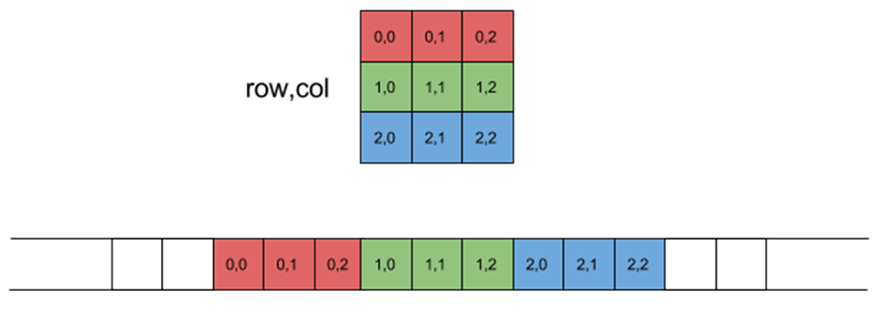
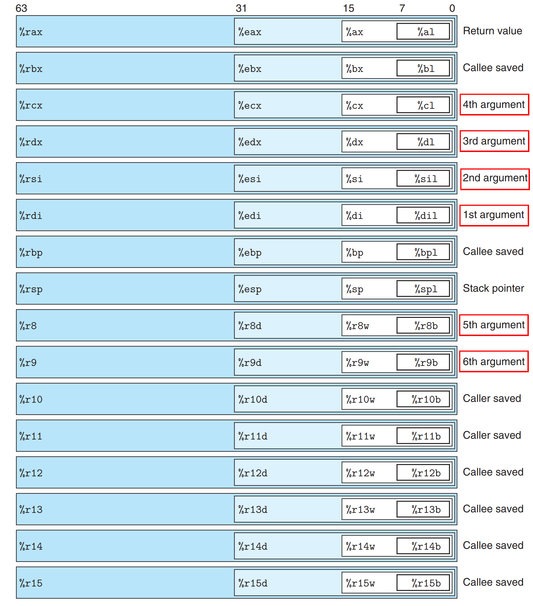
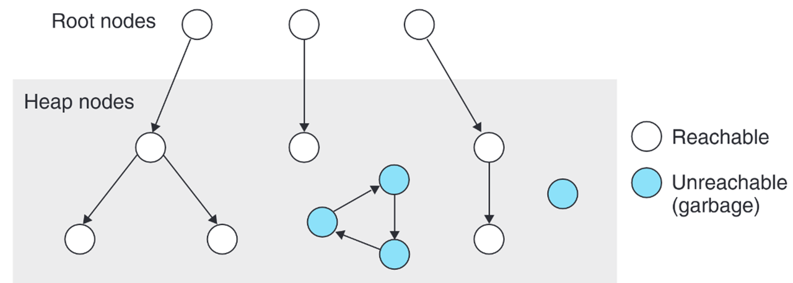
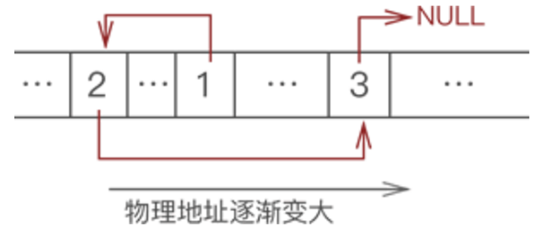

# Lecture5's Note

## 指针

### 为何需要指针

众所周知，C++头文件<algorithm>中有个名为swap的函数，可以方便的交换两个变量的值。

:::tip 🤓不知道什么是swap?STFW从此刻开始!
https://en.cppreference.com/w/cpp/algorithm/swap  
:::  

很可惜，在C中并没有这么方便的标准库函数。  
作为C语言初学者的小P写下了如下一段代码。希望能够实现该功能。

```C
void swap(int a,int b){
    int tmp=a;
    a=b;
    b=tmp;
    return;
}
int main(){
    int x=114,y=514;
    printf("Before swap: x=%d,y=%d\n",x,y);
    swap(x,y);
    printf("After swap: x=%d,y=%d\n",x,y);
    return 0;
}
```

然而在运行后我们却得到结果

```
Before swap: x=114,y=514
After swap: x=114,y=514
```

这是因为，在这段代码中，我们仅仅只是将需要交换的变量的值传递到函数里，函数所做的只是将两个临时变量的值进行交换。  
为了满足这样的需求，C提供了`指针`这一概念，当然指针能做的不止这些。

:::tip 💡***知识祛魅——变量名、变量值与指针***  
在之前的学习中我们了解到，C语言是对过程的描述，而编译器负责将这些描述“翻译”为机器语言，那么，当我们定义一个变量时，对编译器而言，有什么意义？  
假设，我们为所有变量都分配了一个内存空间（事实上，编译器会将一些功能简单生命周期短暂的变量直接使用寄存器实现其功能，而不为其分配空间（有趣的事实，C语言提供了register关键字，使程序员有办法告知编译器这个变量可以直接存储在寄存器中（`更有趣的事实，编译器可以忽略 register 关键字，因为它最终拥有存储变量的决定权，在C语言中有许多企图与编译器传递信息的关键字，然而现代C语言编译器基本都不听`）））  
那么,当我们定义一个变量时，机器为其分配了一片空间，并将**变量名**与这片空间绑定，之后，当我们使用变量名作为操作数时，机器便知道其所代表的空间。这个过程由**符号表**实现，是**ELF**的一部分，具体会在链接这一过程的相关课程中学到。  
也就是说，**变量值**存储在变量名所指代的空间内。  
众所周知，一切皆位值。**指针**所存储的二进制值为地址，运行在不同系统指向不同对象的指针大小可能不相同，但在64位系统上，指针的大小一般都是八字节（为什么？想想64位系统的地址范围）  
也就是说，**指针**与**变量名**十分**类似**，都指向一片空间。如果为指针指向对象赋值，就像对变量赋值一样。  
如果一个指针指向某个变量，它就**类似**于这个变量的“别名”    
如果单个变量的变量名只是与指针有些类似，数组名与指针的关系便更加紧密了。  
数组向系统申请了一片连续的空间区域，而数组名常常被解释为指向这片区域的起始位置（基址）的指针  
当我们访问这个数组的某个元素时，我们根据数组的类型对地址添加一个偏移量，将该地址空间存储的位值解释为需要的类型。  
显然，这一过程我们可以等价的用指针完成。我们将在学习指针相关知识后再次回到这个问题。  
:::

### 指针的定义

见：https://en.cppreference.com/w/cpp/language/pointer

### 指针的使用

#### 取地址符&

指针存储的是地址，如果想要指针指向某个变量，则需要获取那个变量的**地址**，在变量名称前面加&即获取其**地址**。  
但这个**地址**对编译器而言也会解释为一个**指针**，什么类型的变量取地址就会获得对应类型的**指针**。  
在学习指针之前，我们在scanf中见过该符号，我们向scanf传入地址，scanf将数据写入内存空间。也就是说，在编译时，就算我传入的地址事实上并不是用于存放int类型的，编译器也不会**报错**。  
当然，这在运行过程中**极有可能**会引发**错误**，如果将长数据写入短变量就会导致**内存污染**，例如编译器为该地址申请的空间为四字节，你却写入八字节的数据，污染了临近的内存空间。（`这属于UB，你永远无法假定内存空间的分布`）  

#### 解引用符*

指针的一个功能就是充当变量的“别名”  
通过指针储存的地址可以修改指向变量的值，那么解引用符*可以获取这个地址空间**对应指针类型**的值。  

#### 指针赋值

一个指针通常对应了两个值：指针本身指向的地址与指向地址处的数据。  
这意味着我们对指针赋值时需要区分需要修改的是哪个值  
对于前者我们直接使用**指针名**，而后者需要在指针名前加**解引用符***   

```C
int x=114514;
int *ptr;
ptr = &x;
printf("x:[%d] *ptr:[%d]\n",x,*ptr);
*ptr = 1919810;
printf("x:[%d] *ptr:[%d]\n",x,*ptr);
```

运行后得到

```
x:[114514] *ptr:[114514]
x:[1919810] *ptr:[1919810]
```

#### 指针算术运算
与面向对象语言提供的“引用”不同，指针允许算数运算。  
指针与**整数**做加法是根据指向对象的大小对地址施加偏移（幸运的是，此处并没有隐式类型转换，对象不是整数编译器一般都会报错）  
**相同类型**的指针之间做减法得到两个指针之间差了几个指向类型的对象（有正负）（幸运的是，此处也没有隐式类型转换，指针类型不同编译器一般都会报错）  

$$ Type \space ^*p $$
$$ p + x = (Type ^*)((unsigned)P + x \times sizeof(Type)) $$
$$ Type \space ^*p1,\space ^*p2 $$
$$ p1-p2=((signed)p1-(signed)p2)/sizeof(Type) $$

:::tip  
*若p的类型为int**，则Type为int**    
*指针与整数的加法，不同类型指针间的减法都属于**UB***  
*此处类型转换仅助于理解，事实上unsigned和signed类型在大部分标准中无法容纳多数为八字节的指针，在实际执行过程中，这些运算发生了什么需要查阅具体标准*
:::

```C
int x[5]={0,1,2,3,4};
int *p=&a[0];
printf("%x %x\n",p,p+3);
//可能的结果： ffffd7f0 ffffd7fc
int *p1=&x[0],*p2=&x[4];
printf("%d %d\n",p1-p2,p2-p1);
//输出： -4 4
```

:::tip 💡 知识祛魅——字符串
在学习字符串的输入时，初学者大概会迷惑，为什么字符串是一个字符数组，而且输入时不需要取地址符&，而且可以直接用数组名。  
现在我们知道字符数组名在此处被解释为字符指针。  
scanf将一串字符连续放置到该地址开始的一段空间，并在末尾添加‘\0’表示字符串的结束。  
所以，字符串其实就是满足字符串规范的字符数组，当你将一段空间上的数据解释为字符串时，机器会一直遍历这段数据直到遇到’\0’，这也是为什么我们以文本编码形式查看非文本文件时常常看到乱码。  
:::

#### 特殊指针——void*

Void* 被认为是一种通用指针。  
当你需要一个指针去指向某个地址，但是你不知道或还不知道这片地址实际上需要存储着什么类型的信息，那么你可以用void*去记录这片地址。  
虽然能过编译，但请不要对void相关的指针进行加法运算或减法运算，因为void相关类型的size是**UB**的。  

#### 指针的隐式转换

与数字运算不同，指针中极少出现隐式类型转换  
一般仅有任意类型指针会被隐式转换为void*类型指针
仅有void*满足该性质，void**等只是带void的指针就不行  

```C
void* test(int *int_ptr){return int_ptr;}
int main(){
    int array[3]={0,1,2};
    int *int_ptr = &array[0];
    int **int_ptr_ptr=&int_ptr;
    void *void_ptr = int_ptr;
    //正确，可过编译
    void **void_ptr_ptr=int_ptr_ptr;
    //错误，不可过编译
}
```
#### 指针的显式转换

指针指向的是地址，指针的类型决定了解读以该地址开头的一段空间的方式。  
所以指针之间的显式类型转换没有任何限制，因为地址的规范是统一的，但是使用转换得到的指针可能会引发错误：  
- 指向常量的指针转换为指向非常量的指针导致修改常量的行为发生  
- 指向短类型的指针转换为指向长类型的指针导致访问非法内存  

### 指针与数组

我们常用[]来访问数组元素。  
对编译器而言，数组名常常被解释为常量指针，且该指针指向的空间连续分布着数组元素。  
那么，如果我们让指针指向数组起始位置，施加对应的偏移量，是否就可以等效的实现数组的元素访问，或者说，数组对元素的访问在底层上是否就是对地址施加偏移？  

```C
int a[5]={0,1,2,3,4};
int *ptr=a;
printf("%d %d\n",*(ptr+2),a[2]);
//输出： 2 2
//思考： *ptr+2和*(ptr+2)一样吗？
```

事实上，[]和->一样，都是一种后缀运算符，与指针运算确实存在等价关系。  
延申到二维数组上，也就是说有a[x][y]=*(*(a+x)+y)
乍一看，a**似乎**被解释为了指向指针的指针（即**）
但如果仅是如此，上述运算等价于  

$$ Type \space^*ptr=(Type^*)a; $$  

$$ a[x][y]=^*((uintptr_t)ptr+x \times sizeof(Type )+y \times sizeof(Type)) $$  

*uintptr_t，一种用于将指针转为无符号数的类型*  

直观感受，这不仅不能对应N*M个元素而且空间分配甚至有所重叠  
暂时将这个问题搁置，数组名无论被解释为什么，以其为开头的地址对应的一段空间分布着数组元素，那么，如果我们以Type*去访问这段空间，数组元素是如何排布的呢？  
C语言中数组空间分配方式被称为行优先。俗话说先行后列，也就是先按靠左的维度量级均分空间。  
例如对于Type a[N][M]，先将空间整体均分为N份，每份大小为sizeof(Type)*M，然后在将每份分为M份。 



如图所示，当我们访问 Type a[3][3]的元素a[2][1]时  
等价于$Type \space ^*ptr=(Type ^*)a$ $^*(ptr+2*3+1)$  
*注意此处的强制类型转换*  
结合[]的定义，为了让数组访问元素时得到正确的偏移量，我们得到了新的指针定义方式  

$$ Type (^*ptr)[M] $$  

指该指针指向的空间区域分布着M个Type类型数据。  
注意此处的括号，是为了将指针数组与指向数组的指针做区分
对解释器而言，主要的不同在于  

$$ ptr+1=(Type ^*)((uintptr_t)ptr+M\times sizeof(Type)) $$

同理，对于  

$$ Type \space ^*ptr[N][M] $$

$$ ptr+1=(Type ^*)((uintptr_t)ptr+N\times M\times sizeof(Type)) $$

在定义指针时M可以为空,表示数量未知，如$Type \space ^*ptr[]$ ，当任意一维按此法定义对该指针做整数加法都属于UB  
指针与数组之间有许多关联但也有许多不同：虽然数组名常常被解释为指针，但是其本身并不是指针。首先它不能被修改，其次将其作为sizeof的参数时，返回的是数组所占空间大小。

```C
int a[3]={0,1,2};
int (*ptr)[3]=a;
printf("%d %d\n",sizeof(a),sizeof(ptr));
//输出：36 8
```

## 结构体
参考：https://en.cppreference.com/w/c/language/struct  
与其他类型一样，结构体申请了一片空间，并对这片空间做出了解释，只是结构体在一片空间中解释了多个变量。为此，编译器在解释结构体时，需要计算各个成员从基址开始的偏移量，将基址施加偏移量后的地址解释为该成员变量的地址。  
出于内存访问效率要求，结构体的各个成员还存在内存对齐要求。这导致结构体的大小有时不等于各个成员大小之和。  
对齐相关知识参考：https://en.cppreference.com/w/c/language/object  

:::tip 💡知识祛魅——函数传参
在计算机中，内存是分层级的，效率越高的内存数量越稀少，反之亦然。  


在x86_64架构下，仅有六个寄存器用于传递函数参数，而且每个寄存器仅能容纳64bit的数据。  



也就是说，当你调用超过六个参数时，会有参数不通过寄存器传递，导致程序效率变低。这些多余的参数会放置在名为栈的一片内存区域，也是通过记录偏移量来访问这些参数。
对于结构体而言，如果你传递的是结构体指针，那么可以存放于寄存器内。但是如果传递的是结构体本身，它大概率是放在堆栈中的，因为寄存器无法容纳其大小。
然而！编译器对你的代码有着最终解释权。就算你传递的是结构体本身，编译器确信你的代码没有没有对结构体修改于是解释为传递指针。又或者你的结构体成员很少，于是编译器将其拆分到多个寄存器进行传递。
:::

## Malloc

参考：  
https://en.cppreference.com/w/c/memory/malloc  
https://en.cppreference.com/w/c/memory/free  

### 申请空间

可以将将计算机中一片连续的空间看成一个大数组，malloc的事情就是找到一段空白并将其标记为已使用，并将这段空白的起始位置返回。


上面这张图展示了分配空间的一种可能性，在实际使用中，你**任何时候都永远不能**假设内存的分配方式。

### 释放空间

对于大多数现代编程语言，如Java、Python等，都有着自带的垃圾回收器，能够自动检测不再可访问的内存区域并将其释放。  
然而C语言中，需要我们手动释放空间，否则所有的垃圾只会到程序结束的时候释放。理论上来讲这会带来更高的时间效率与空间效率（垃圾回收器常常是保守的），只要你有良好的代码习惯，变量随用随放，然而大多数时候只会带来花样百出的内存泄露问题。 



在malloc的使用中，指针作为管理内存的工具存在。也就是说，如果一片空间没有指向它的指针，或没有其他可访问空间存储的指针指向它，那么它就是不可访问的空间，也就是垃圾。  

 

紧接之前的局面，将p2所指空间释放后，这片空间就可以供其他malloc请求使用。  
不进行free会带来内存泄露问题，但进行不恰当的free同样也会引发问题，我们会在下文介绍一种由free创造的一类危险指针

:::tip 💡知识祛魅——内存泄露
- 定义：无法释放分配的内存
  - 初始症状：无任何症状
    - 在达到临界点之前，内存泄漏实际上并不是问题
  - 后来的症状：表现急剧下降......
    - 然后你的程序就被杀死了！
    - 因为当你请求更多内存时，操作系统会说“不，不能这样做”
- 参考：https://godbolt.org/z/rqbGsKov1  
:::

## 危险的指针

指针是一个强大的工具，提供了程序员与底层交互的可能性，打破了一定的抽象障碍。    
但同时，莫大的权限也带来了许多问题，下面我们将介绍几类。  

### 野指针

C中的指针可以任意赋值，当一个指针未初始化或错误地初始话时便成为了野指针，如： 

```C
int *ptr1, *ptr2 = (int *)0x11451400;
```

### 空悬指针
当一片空间被释放时，所有指向这片空间的指针都成为了空悬指针。此时这个地址已经成为无效地址，可能被分配给其他程序或者当前程序的其他指针，此时去解引用这个指针会引发错误，如：  

```C
int *ptr=(int *)malloc(sizeof(int));
free(ptr);
printf(“%d\n”,*ptr); //ERROR
```

### 越界指针
对指针做算数运算是很常见的，但是当我们使用指针去访问数组元素时，如果运算后的结果超过了数组的空间区域，便会引发错误

```C
int a[5];
int *ptr=&a[4];
ptr+=1;
printf(“%d\n”,*ptr); //ERROR
```

### 空指针
与前面几个指针不同，空指针的存在是合理的，但是解引用空指针会引发错误。  
事实上，保持未利用的指针是空指针有助于你的调试。假设一个值错误的指针恰好对应了某个可调用的区域，污染了某个区域的数据，你可能会在相隔这个指针甚远的区域发现这个错误而且无法与这个指针产生联系，这是相当致命的。  
```C
int *ptr=NULL;
int sum=0;
//case1
assert(ptr!=NULL);
if(*ptr>0) sum+=*ptr;
//在理论上指针不应该为空的地方使用assert保证指针非空
//并且你可以在指针为空时立刻知道意料之外的情况已经发生
//case2
if(ptr==NULL) continue;
if(*ptr>0) sum+=*ptr;
//case3
if(ptr!=NULL&&*ptr>0) sum+=*ptr;
//在正常情况下指针可能为空的地方，在解引用指针前对指针特判。可以直接写一个逻辑判断语句（case2），也可以利用&&的短路特性（case3）
//你可能需要的参考
//assert
//https://en.cppreference.com/w/cpp/error/assert
//&&
//https://en.cppreference.com/w/cpp/language/operator_logical
```

***在解引用指针前一定要确保指针实际上确实非空***
***错误的假设是调试的痛苦之源😭***

## 链表

***可能还是需要将一些过程拆得更细，做一些风格统一的矢量图😟***

参考：https://mathcenter.oxford.emory.edu/site/cs171/linkedLists/

链表是一种可以用于管理动态申请来的空间的数据结构

### 链表特点

使用链表存储数据时，不强制要求数据在内存中连续存储，各个元素可以分散存储在内存中。

  

### 链表结构

- data：数据
- nxt：记录这个节点之后的节点
- pre：记录这个节点之前的节点

```C
typedef int Type;
//Type可以是任何你需要的数据类型
struct Node{
    struct Node *pre,*nxt;
    Type data;
};
typedef struct Node node;
```

我们申请空间时会得到一个指向该空间的指针，所以pre和nxt的类型也是指针，指向相邻节点的地址  
当我们需要遍历链表时，肯定需要有一个起点，我们称这个起点为头指针，指向最靠前的节点，该节点的pre为NULL  
当我们向链表插入节点时，没有特殊的要求时会将其插入到尾部，也就是最后一个节点之后，指向该节点的指针成为尾指针，该节点的nxt为null 

```C
node *head=NULL,*tail=NULL;
//虽然全局变量初值皆为0，但是初始化是个好习惯🤓
```

### 链表操作

#### 遍历链表

```C
/*
传入位次
返回指向对应节点地址的指针
*/
node *find(int rank){
    int i=0;
    node *tmp=head;
    for(;i<rank-1;i++){
        tmp = tmp->nxt;
    }
    return tmp;
}
```

*不难发现，与数组常数级查询复杂度不同的是，查询数据的时间复杂度与数据总量成正比，这也是链表的一个劣势。*

#### 尾部插入节点

```C
void add_tail(Type data){
    node *tmp = (node *)malloc(sizeof(node));
    tmp->data = data;
    tmp->pre = NULL;
    tmp->nxt = NULL;
    if(head == NULL){
        head = tmp;
        tail = tmp;
        return;
    }
    tail->nxt = tmp;
    tmp->pre = tail;
    tail = tmp;
    return;
}
```

#### 指定节点后插入节点

```C
void add_node(node *pos,Type data){
    if(pos==tail){
        add_tail(data);
        return;
    }
    node *tmp = (node *)malloc(sizeof(node));
    tmp->data = data;
    tmp->pre = NULL;
    tmp->nxt = NULL;
    tmp->pre=pos;
    tmp->nxt=pos->nxt;
    pos->nxt->pre=tmp;
    pos->nxt=tmp;
}
```

#### 删除指定节点

```C
void delete(node *pos){
    if(head==tail){
        head = NULL;
        tail = NULL;
        return;
    }else if(pos == head){
        head=pos->nxt;
        head->pre=NULL;
    }else if(pos == tail){
        tail = pos->pre;
        tail->nxt = NULL;
    }else{
        pos->nxt->pre=pos->pre;
        pos->pre->nxt=pos->nxt;
    }
    free(pos);// 不要忘！
    return;
}
```