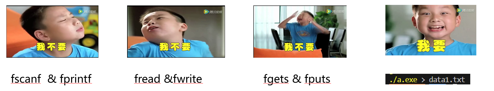
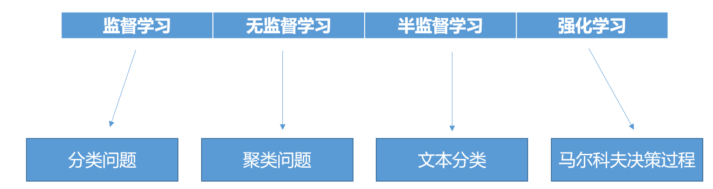
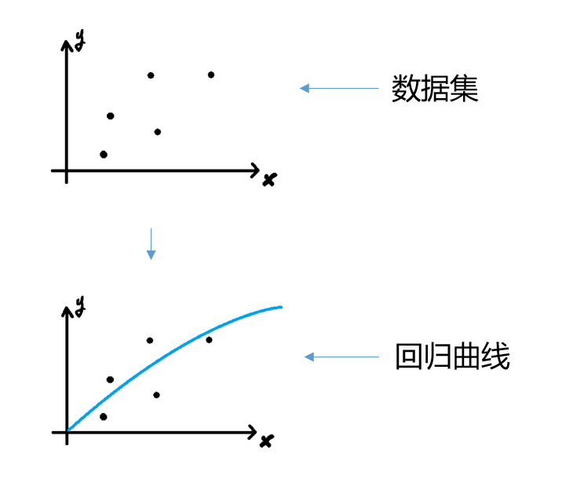

{
    "author": {
        "name": "晓阳",
    },
    "departments": [
        {
            "name": "NekoBytes",
            "url": "https://github.com/E1PsyCongroo/NekoBytes-TheMissing",
            "img": "./static/hdu-cs-wiki.svg"
        }
    ]
}
+++++

# I/O & AI Introduction

---

# Part1 I/O Introduction


--

<center>
**<red>We need save!</red>**
</center>

--

<center>
**<red>Save need I/O</red>**
</center>

----

## Agenda

1. C语言I/O库概述
2. 标准输入输出函数
3. 文件操作
4. 标准输入输出和错误输出
5. 终端重定向

----

## C语言I/O库概述

`stdio.h` 是C标准库中的头文件，提供了输入输出功能的定义和声明。

```C
#include<stdio.h>
```


----

## 标准输入输出函数

更为细节的用法可以参看C primer plus 或者在vscode中将鼠标指针悬停在函数名上，就能看到具体需要的参数

`scanf()` 和 `printf()` 用于格式化输入输出。

```C
//一个简单的示例代码，用于实现输出和用户输入相同的整数
#include<stdio.h>

int main(void) {
  int t = 0;
  scanf("%d",&t);
  printf("%d",t);
  return 0;
}
```

----

- `getchar()` 和 `gets()` 用于字符输入。

```C
#include<stdio.h>
int main(void) {
  char c, str[20];
  //getchar从标准输入中读取一个字符
  c = getchar();
  // gets会读至换行，且不会检查目标缓冲区大小，所以不推荐使用，可以使用fgets替代
  /* gets(str); */
  fgets(str, 20, stdout);
  return 0;
}
```

----

`puts()` 和 `putchar()` 用于字符串和字符输出。

```C
#include<stdio.h>
int main() {
  char c = 'a';
  char d[] = "NekoBytes";
  putchar(c);
  putchar('\n');
  puts(d);
  return 0;
}

```

----

## 文件操作


----

--

- 为什么使用缓存(buffer)？

--
    - 提高效率：

    直接从磁盘读取数据到内存或从内存写入数据到磁盘是相对较慢的操作。通过使用缓存区，可以减少对磁盘的直接访问次数。操作系统会将数据先读入缓存区，然后再从缓存区读取到应用程序，这样可以显著提高数据访问速度。

--

    - 减少I/O操作次数：

    磁盘I/O操作是计算机系统中最慢的操作之一。通过缓存区，可以将多次小的读写请求合并成一次较大的读写操作，从而减少I/O操作的次数，提高系统性能。

----

- 为什么使用缓存(buffer)？

--

    - 数据完整性：

    在文件写入过程中，数据首先被写入到缓存区。当缓存区满了或者操作系统决定将数据写入磁盘时，缓存区的数据才会被一次性写入磁盘。这种方式可以确保数据的完整性，避免因突然断电等情况导致的数据丢失。

--

    - 数据一致性：

    缓存区还可以帮助维护数据的一致性。当多个进程或线程同时访问同一个文件时，缓存区可以协调这些访问，确保数据的一致性和正确性。

----

- 为什么使用缓存(buffer)？

--

    - 预读和后写：

    操作系统通常会实现预读（预加载）和后写（延迟写入）策略。预读是指操作系统预测应用程序接下来可能会读取的数据，并提前将其从磁盘读入缓存区。后写则是将数据暂时存储在缓存区，直到系统认为合适的时候再写入磁盘。这两种策略都可以提高文件操作的效率。

--

    - 减少磁盘磨损：

    频繁的磁盘读写操作会加速磁盘的物理磨损。通过缓存区，可以减少对磁盘的直接访问，从而延长磁盘的使用寿命。

----

- 为什么使用缓存(buffer)？

--

    - 支持随机访问：

    缓存区使得文件的随机访问变得更加容易。应用程序可以通过缓存区快速访问之前已经读取过的数据，而不需要每次都从磁盘读取。

--

    - 支持多种文件访问模式：

    缓存区可以支持不同的文件访问模式，如顺序访问、随机访问等。这使得文件操作更加灵活和高效。

----

文件操作涉及到操作句柄`FILE*`。

打开文件`fopen()`，关闭文件`fclose()`

```C
#include<stdio.h>
int main(void) {
  FILE* fp = NULL;
  // 参数顾名思义
  fp = fopen("filename", "mode");
  // 关闭文件
  fclose(fp);
  return 0;
}

```

----

## 标准输入输出和错误输出

- 标准输入：`stdin`
- 标准输出：`stdout`
- 标准错误输出：`stderr`

由此，我们可以在程序中将标准输入输出重定向到某个文件

```C
#include<stdio.h>
int main(void) {
  //输入重定向至data1.txt
  freopen("data1.txt", "r", stdin);
  //输出重定向至data2.txt
  freopen("data2.txt", "w", stdout);
  int num;
  scanf("%d", &num);
  printf("%d", num);
}
```

----

### 终端重定向



----

通过使用`<`或`>`符号，可以在终端完成输入输出的重定向。

```C
#include<stdio.h>
int main(void) {
  char s[20];
  scanf("%s", s);
  printf("%s", s);
  return 0;
}
```

----

要在终端中重定向输入输出，我们首先需要将对于的源码程序编译为可执行文件：

```shell
gcc ./test.c -o test.out
```

随后，使用"<"重定向输入，">"重定向输出

```shell
gcc ./test.out < data1.txt > data2.txt
```

这样就能实现从data1.txt中读取字符串，再输出至data2.txt中

---

# Part2 AI Introduction

<center>

</center>

----

## Agenda

1. AI vs ML
2. AI能帮我做什么？
3. 机器学习的主要类型
4. 线性回归的基本讲解

----

## AI vs ML

- AI（人工智能）：模拟人类智能进行任务的能力。
- ML（机器学习）：通过数据和算法让系统自动学习和改进。

----

## AI能帮我做什么？


----

--

- 代码debug
    - 直接将代码和出现的报错丢给GPT/KIMI/文心一言，可以快速找出一些简单的语法错误，或者快速将看不懂的报错翻译成看得懂的报错，从而为后续debug提供帮助。

--

- 快速给出设计思路
    - 搭建论文的框架，提供论文的讨论方向，为程序设计思路，甚至午饭吃什么！

--

- 翻译外文文献
    - 传统的翻译软件目前已经在开始引入大模型，但是既然都是引入了，为什么不直接把文献丢给大模型呢？相对而言，你会得到更好的上下文连贯性和相对精确的专业名词解释。

----

--

- 总结报告
    - 文献太长？T(oo)L(ong)D(on't)R(ead)！目前很多大模型都已经支持了上传pdf等格式的文件，将冗长的文献丢给AI让它为你精确概括似乎是提高阅读效率的一种方式。

--

- 提供搜索引擎服务
    - 同上，网上驳杂的信息太多，又或者你自己都不知道应该如何提问，那么不妨试试大模型吧！把问题给他，至少他不会在你问出无意义问题时告诉你”STFW“或者”RTFM“，相反，他会尽他所能为你罗列可能遇到的情况，这样就能加快你的搜索效率。

--

- 解释难题
    - 虽然AI做数学题往往会用错误的过程推出错误的答案，但是它仍然可以在你一筹莫展时为你提供一些之前没有想到的思路，甚至直接告诉你正解，相对于大多数拍题软件只给答案不给过程，大模型通常会告诉你每一步的原因（虽然很多时候是错的），不过结合搜题软件的过程让它解释为什么也不失为一个好的方式。

--

- <del>在完全不听的情况下完成水课作业</del>

----

## 机器学习的主要类型



----

- 监督学习（Supervised Learning）：
    - 目标是训练一个模型，使其能够预测或决定未见过的数据的标签。

    包括回归（Regression）和分类（Classification）问题。

    常用的算法有：线性回归、逻辑回归、决策树、支持向量机（SVM）、神经网络等。

- 无监督学习（Unsupervised Learning）：
    - 目标是发现数据中的模式或结构，而不需要预先定义的标签。

    主要包括聚类（Clustering）和降维（Dimensionality Reduction）。

    常用的算法有：K-means聚类、层次聚类、主成分分析（PCA）、自编码器等。

- 半监督学习（Semi-supervised Learning）：
    - 结合了监督学习和无监督学习的特点，使用少量的标记数据和大量的未标记数据进行训练。

    常用于数据标签获取成本较高或数据量巨大的情况。

----

- 强化学习（Reinforcement Learning）：
    - 通过与环境的交互来学习如何做出决策，目标是最大化累积奖励。

    常用于游戏、机器人控制等领域。

    常用的算法有：Q学习、Sarsa、深度Q网络（DQN）、策略梯度方法等。

----

## 线性回归的基本讲解

回归分析是一种预测性建模技术，研究自变量和因变量的关系。

线性回归使用线或曲线拟合数据点。



----

可参考

- [线性回归模型详解(Linear Regression)](https://blog.csdn.net/iqdutao/article/details/109402570)

- [深度学习之梯度下降法 Part 2 ver 0.9 beta](https://www.bilibili.com/video/BV1Ux411j7ri/?spm_id_from=333.999.0.0&vd_source=064201691336866daa89c1444d12e27a)

---

### 作业

1. 读取数据集的线性回归预测方法 (Lab)
2. SoftMax分类或简易神经网络搭建 (Proj3)
