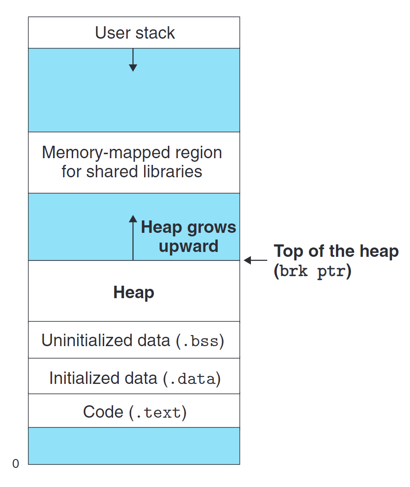
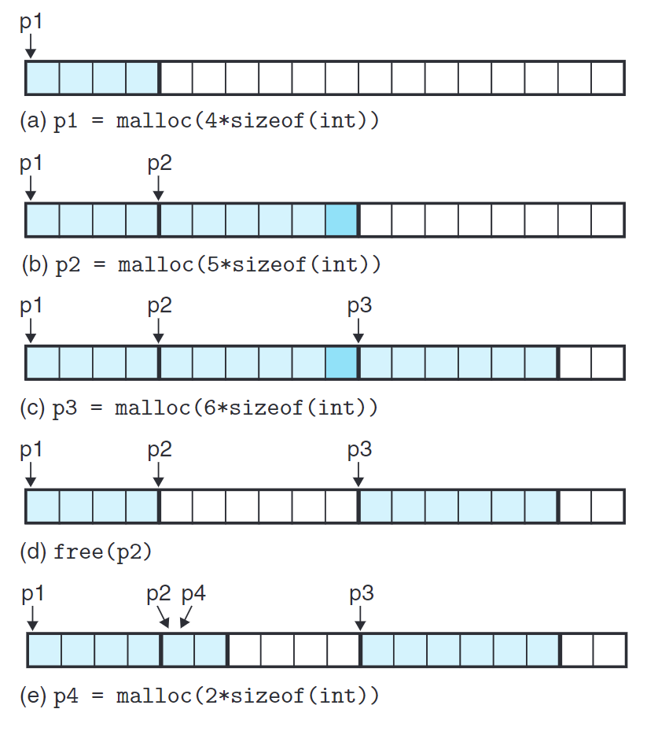
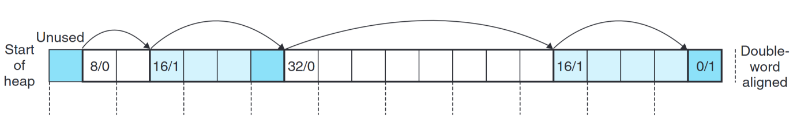

# 什么是虚拟内存（Virtual Memory）

如上图所示，我们可以将计算机中的虚拟内存视作一根条状物，下方为低地址处，上方为高地址处
虚拟内存的大小仅与你的系统类型有关（如64位系统与32位系统的最高地址不同）
这样的特性消弭了硬件上的差距，使得工程师不用为特定的硬件设计特定的程序，这样消除硬件差距，用抽象性统一程序的设计在计算机系统中比比皆是
当然，虚拟内存的设计还有许多妙用，例如它让所有程序都认为自己拥有独立的内存空间，感兴趣的同学可以自行学习CSAPP第九章内容，此处不再展开

# 虚拟内存中的堆与栈
从高地址向低地址扩展，这是我们熟悉的**栈**，用于存储局部变量、函数参数、返回地址等。
而自低地址向高地址扩展的，则是**堆**，用于分配连续空间给程序使用，如全局数组。
这里的“**堆**”与数据结构中的“**堆**”并不相同，前者是虚拟内存中一片区域的称呼，后者是一种树状数据结构。
因为前者与“**栈**”同属于一片区域，且在功能上有一定相似性，常被人们合称为**堆栈**，但是我并不喜欢这个词汇，大多数时候只会带来歧义与误解，除了。。。

*笑点解析：这张牌英文原名就是Stack*

# 堆空间的动态分配
除了编译时就已经确定的空间大小（静态初始化），对于剩余的堆空间以及程序随运行给出的不同需求，我们需要一个分配器，大致分为两种：显式分配器与隐式分配器。这二者都需要**显式**地去分配块，但对分配内存这一事情的行为主体有所区别。
```c
#include <stdio.h>
#include <stdlib.h>
int main() {
    // 1. 整型数组
    int *intArray;
    int size = 5;
    intArray = (int *)malloc(size * sizeof(int)); // 分配5个整数大小的内存空间
    free(intArray); // 释放整型数组内存空间
    // 2. 字符串数组 (字符指针数组)
    char **stringArray;
    size = 3;
    stringArray = (char **)malloc(size * sizeof(char *)); // 分配3个字符指针大小的内存空间
    free(stringArray); // 释放字符串指针数组空间
    // 3. 结构体数组
    struct Student {
        char name[20];
        int age;
    };
    struct Student *studentArray;
    size = 2;
    studentArray = (struct Student *)malloc(size * sizeof(struct Student)); // 分配2个结构体大小的内存空间
    free(studentArray); // 释放结构体数组空间
    return 0;
}
/*
可以发现，malloc的空间大小是用户根据所需大小手动申请，最终的类型也是用户强制类型转换得到的。
*/
```
隐式分配器的典型便是Java，他将内存分配的行为主体交给了程序，用户只要描述自己的需求，便能得到一片动态申请的空间（当然出于静态类型语言的要求，你依旧要指定指向这片内存区域的指针类型，出于面向对象的特性，你往往会比C拥有更多的选择类型），并且Java中的数组如果是通过new关键字来申请，其大小随时可以改变。程序会自动侦测不再被使用的内存块，并将其回收，这一过程被称作垃圾回收（Garbage Collection）。
```java
public class ArrayDemo {
    public static void main(String[] args) {
        // 动态分配：使用 new 关键字创建数组，在堆内存中分配空间
        int[] arr1 = new int[5]; // 初始化大小为 5 的数组
        // 大小可变：使用 Arrays.copyOf() 方法将数组扩容到 10
        arr1 = Arrays.copyOf(arr1, 10);
    }
}
```
# 内存分配器
## 内存分配器的行为
在不同的系统上，对分配器有着不同的要求，下文中，我们假设内存分配器需要对双字对齐。字大小采用x86-64定义，为16bit。

如上图所示，内存分配器根据程序指令进行了以下行为：
- 申请四字空间，p1指向这片空间
- 申请五字空间，p2指向这片空间，但是分配器最终分配了六字（因为五字不行）（保证内存空间对齐）
- 申请六字空间，p3指向这片空间
- 释放p2所指的块，注意此时并没有清空指针p2的值，p2依旧指向一片处于未利用状态的空间区域
- 申请二字空间，p4指向这片空间，此时p2与p4指向同一个位置

注意到，分配器要做的事情非常简单，只需要返回满足大小需求的未占用空间的地址即可。理论上你可以写一个天底下最烂的内存分配器——每次都返回最靠近尾部的空闲地址，放不下就向系统申请内存空间。
因此，我们要对好的分配器下定义，学习分配器设计的限制与好的分配器的追求。

## 内存分配器的限制
标准通用的分配器存在诸多限制，分配器不仅要为不同程序服务，还要对多个程序服务。
- 不能对操作的顺序做任何假设，不能假设这个块之后会被free所以先malloc给某个程序
- 不能离线处理操作，必须在线立即处理操作。意思是，你不能积攒你收到的请求然后按最适合你分配器实现的方式排序，然后再执行
- 保证你的块按照对齐标准对齐（在本项目中，向8bit对齐）
- 不能修改已分配的块，也就是说不能移动已分配的块

## 内存分配器的追求
在上述约束条件下，分配器的设计者追求在两个相互冲突的指标之间寻求平衡：吞吐量与内存利用率。二者所代表的分别是时间效率与空间效率。
吞吐量指单位时间内完成的分配请求（malloc与free）数量。
单独提高这个指标并不难，例如上述那个”天底下最烂的内存分配器“在这个指标上大概能薄纱所有主流分配器。
而内存利用率则是指在你的分配器整个运行过程中，所有时刻中已分配块的合计大小的最大值与运行结束后堆大小的比。也就是你越充分利用了整个堆空间，这项指标越高。
更多的时候，内存分配器的开发者对后者更为在意，那么，是什么导致堆空间总是无法得到充分利用呢

## 碎片
我们称堆空间没有得到充分利用的现象为碎片（Fragmentation）
碎片分为内部碎片（Internal fragmentation）与外部碎片（External fragmentation）
### 内部碎片
内部碎片是指堆栈实际剩余空间加起来也无法满足空间申请需求，因此被迫扩展堆大小，这是可以量化且显而易见的，如果你能够减少外部碎片，一般而言内部碎片也会随之减少。
### 外部碎片
外部碎片则是因为你的分配器给出的分配方案不够理想造成的，例如现在需求一块八字空间，但是只有两块空闲的四字空间，虽然从内部碎片的角度来看并没有产生内部碎片，但是由于无法分配八字空间，堆空间依旧被迫扩大造成浪费。
针对外部碎片，大多数分配器选择少而大的空闲空间，而不是多而小的空闲空间。这是一种启发式的思路，也就是给算法定义出什么是”优秀“的情况，并让算法以达成这种情况为目的运行。

## 内存分配器的结构
显然，面对这样的问题，我们需要一些数据结构
这个数据结构要解决两个基本问题：
- 如何找到可分配的空闲块？
- 在释放区块后如何将区块合并，并保持算法原有性质？
对于一些基础良好的读者，他可能会想，我能不能用线段树或者平衡树这样的高级数据结构来解决这个问题，这似乎在时间和空间上都极度优越
然而，我们要考虑到，维护堆空间分配的数据结构也是堆空间的一部分（虽然在本实验中我们不要求将维护使用的数据跳过抽象层直接写入堆空间，但事实上这些数据都将计入你的空间成本），也就是说使用越复杂的数据结构去维护内存分配器，天然地会扩大内存分配器的内部碎片与外部碎片
那么，有没有一个简洁的数据结构能解决这个问题呢？
事实上，作为大多数程序员接触的第一个数据结构，链表就能解决这个问题，下面，我将介绍本次实验使用的隐式链表第一顺位优先算法的思路

# 算法设计

## 隐式链表

同目录下的mm.h,有如下对链表节点的声明：
```C
struct Block {
  struct Block *pre;
  struct Block *nxt;
  void *ptr;
  size_t size;
  int empty;
};
typedef struct Block block;
extern block *head, *tail;
```
使用头指针与尾指针指向当前链表的头和尾
我们记录每一块的前一块和后块，保证遍历和增删的可维护性
对于块本身，我们记录块所对应的空间的起始位置的指针，块管理的空间大小已经块为空或非空
如上图，所有块无论空与非空都记录在链表中，作为内存分配器的关键信息——空闲块，隐式的存在于该链表中，所以称为隐式链表
对于该链表结构，在本项目中，我们需要他实现以下功能：
- 寻找剩余空间充裕的空闲块
- 将空闲块的空间进行分配，可能插入新块，维护它（们）的信息
- 向堆申请更多空间，并将该空间用块维护
- 将占用状态的块释放，维护它的信息
- 将相邻的空闲块合并

## 第一顺位优先
显然，在申请空间的时刻，满足该空间需求的块可能有多个，那么我们的算法该如何找到这样块，以什么标准优先选择怎样的块
在本项目中，我们使用第一顺位优先算法(first fit)
从链表头开始，顺序遍历，当找到可用的空闲块，立刻返回该块的信息

# 让我们开始吧
请继续阅读同目录下的README.md


